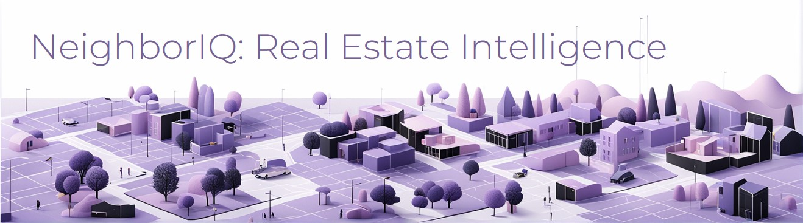
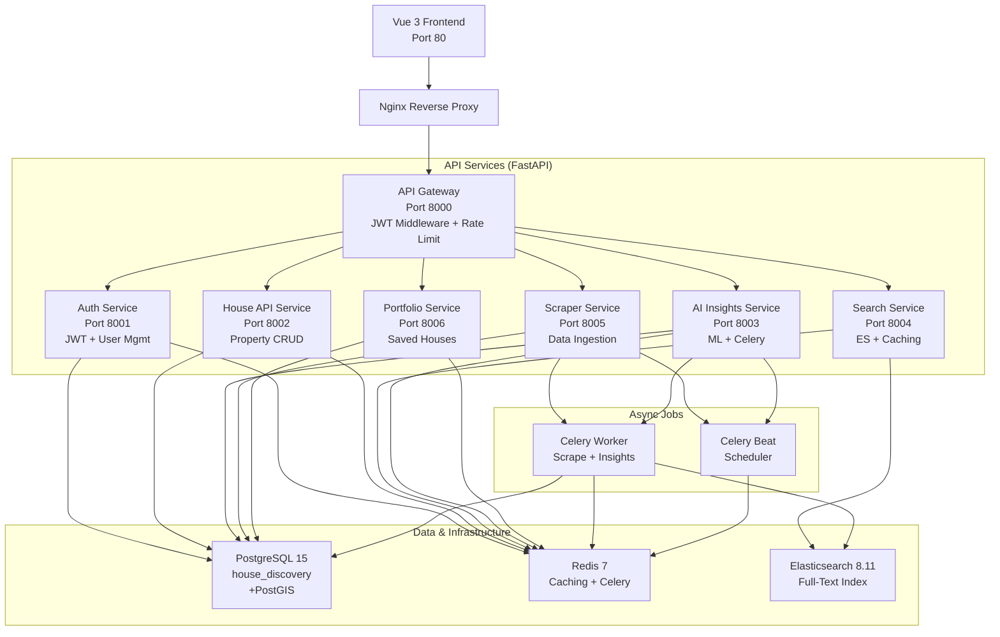
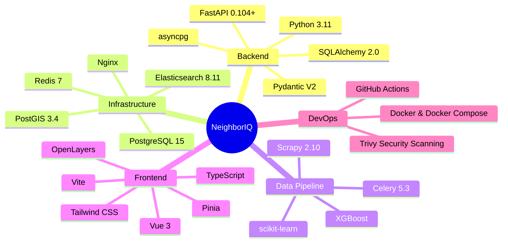

# NeighborIQ

[](https://github.com/e-choness/neighboriq/actions/workflows/ci-cd.yml)
[](LICENSE)
[](https://www.python.org/downloads/release/python-3110/)
[](https://docs.docker.com/compose/)
[](CONTRIBUTING.md)

**NeighborIQ** is an AI-powered Canadian real estate intelligence platform. It combines microservices architecture with machine learning to deliver actionable neighborhood insights, price predictions, and investment analytics for Canadian residential markets.



## At a Glance

- **🏘️ Data-Driven Insights** — Scrapy-powered data pipeline ingests listings from Canadian real estate markets into a unified database
- **🧠 ML-Powered Predictions** — XGBoost models predict property prices and rental yields with confidence intervals
- **🔍 Full-Text + Geo Search** — Elasticsearch indexes properties for multi-dimensional search (location, price, community); results cached in Redis
- **🔐 Enterprise Auth** — RS256 JWT tokens with refresh rotation, cookie-based session management, JWKS-aware middleware

## System Architecture



## Technology Stack



## Quick Start

### Prerequisites

- Docker Desktop (or Docker + Docker Compose v2)
- Git
- ~15 min setup time

### Start the Full Stack

```bash
git clone https://github.com/e-choness/neighboriq.git
cd NeighborIQ

# Start all services (database, Redis, Elasticsearch, all APIs, frontend)
docker-compose up -d

# Wait for services to be healthy (~30-60 seconds)
docker-compose ps

# Tail logs to see startup progress
docker-compose logs -f
```

### Access the Application

- **Frontend (Vue SPA)** — http://localhost
- **API Gateway** — http://localhost:8000/docs (Swagger UI)
- **Auth Service** — http://localhost:8001/docs
- **House API Service** — http://localhost:8002/docs
- **Search Service** — http://localhost:8004/docs

### Run Tests

```bash
# Run the full test suite via Docker
docker-compose --profile test up --abort-on-container-exit
```

## Service Port Map

| Service | Port | Description |
|---------|------|-------------|
| **API Gateway** | 8000 | Request boundary, JWT middleware, rate limiting |
| **Auth Service** | 8001 | User registration/login, RS256 JWT, JWKS |
| **House API Service** | 8002 | Property/community CRUD, filtering, pagination |
| **AI Insights Service** | 8003 | ML price prediction, rental yield, Celery worker |
| **Search Service** | 8004 | Elasticsearch full-text + geo-spatial search |
| **Scraper Service** | 8005 | Data ingestion control API, Scrapy pipeline |
| **Portfolio Service** | 8006 | User saved houses / watchlist |
| **Frontend (Nginx)** | 80 | Vue 3 SPA |

## Documentation

Comprehensive documentation is available in the `/docs` directory:

### Architecture & Design
- [**System Architecture**](docs/architecture/overview.md) — Microservices topology, request lifecycle, service responsibilities
- [**Data Models**](docs/architecture/data-models.md) — Database schema (ER diagram), SQLAlchemy ORM models

### Service Documentation
- [**API Gateway**](docs/services/api-gateway.md) — JWT middleware, JWKS caching, rate limiting, routing
- [**Auth Service**](docs/services/auth-service.md) — User authentication, RS256 token generation, cookie strategy
- [**House API Service**](docs/services/house-api-service.md) — Property API, filtering, pagination, price history
- [**Search Service**](docs/services/search-service.md) — Elasticsearch indexing, geo-spatial search, Redis caching
- [**AI Insights Service**](docs/services/ai-insights-service.md) — ML pipeline (XGBoost), Celery tasks, narrative generation
- [**Scraper Service**](docs/services/scraper-service.md) — Scrapy spiders, pipeline stages, task scheduling
- [**Portfolio Service**](docs/services/portfolio-service.md) — Saved houses, watchlist management

### Frontend & Development
- [**Frontend Overview**](docs/frontend/overview.md) — Vue 3 SPA architecture, routing, components, state management
- [**Getting Started Guide**](docs/development/getting-started.md) — Docker Compose setup, environment variables, common commands
- [**Testing Guide**](docs/development/testing.md) — Docker-based testing strategy, CI/CD pipeline, test profiles

## Development Workflow

### Local Development

```bash
# Start the stack in development mode
docker-compose up -d

# View logs for a service
docker-compose logs -f auth-service

# Run migrations (if needed)
docker-compose exec api-gateway python -m alembic upgrade head

# Execute commands in a container
docker-compose exec auth-service python -m pytest -v
```

### Important Note on Testing

⚠️ **All tests must run via Docker Compose.** Never run `pytest` or `uvicorn` directly on your host machine. Use:

```bash
# Correct: Docker-based testing
docker-compose --profile test up --abort-on-container-exit

# Incorrect: Do not run locally
# pytest services/auth-service/tests/  ❌
# uvicorn services/auth-service.main  ❌
```

### Code Style

This project uses **Black** for formatting and **isort** for imports. The CI pipeline enforces these checks.

```bash
# Format code (runs in service container via Docker)
docker-compose exec auth-service black app/
docker-compose exec auth-service isort app/
```

## Architecture Highlights

### Single Responsibility Microservices

Each service owns its domain and data:

- **Auth Service** — user identity, tokens
- **House API Service** — property catalog
- **Search Service** — search indexing and retrieval
- **AI Insights Service** — price predictions, rental analysis
- **Scraper Service** — data ingestion
- **Portfolio Service** — user saved houses
- **API Gateway** — security boundary (authentication, authorization, rate limiting)

### Shared Infrastructure

All services connect to a single PostgreSQL database (`house_discovery`) with domain-prefixed tables (`house_*`, `auth_*`, `portfolio_*`). This design avoids the operational complexity of database-per-service while maintaining clear boundaries.

### Async-First Backend

FastAPI with `asyncpg` enables high concurrency. Celery workers handle long-running tasks (ML inference, scraping).

### Production-Ready Authentication

RS256 JWT tokens with JWKS endpoint. Gateway caches JWKS for 5 minutes to avoid per-request calls to auth service. Refresh token rotation prevents token reuse.

### Intelligent Caching

Redis caches are layered:
- Search results (30-min TTL, query-hashed keys)
- User sessions (via refresh tokens)
- Celery task results

## Deployment

NeighborIQ is designed for containerized deployment. See [DEPLOYMENT.md](docs/DEPLOYMENT.md) for production configuration and scaling guidance.

## Contributing

Contributions are welcome! Please open an issue or PR. Follow the code style guidelines (Black formatting, Pydantic schema validation, async/await patterns).

## License

This project is licensed under the MIT License — see [LICENSE](LICENSE) file for details.

## Support

For questions, issues, or feature requests, please use [GitHub Issues](https://github.com/e-choness/neighboriq/issues).
