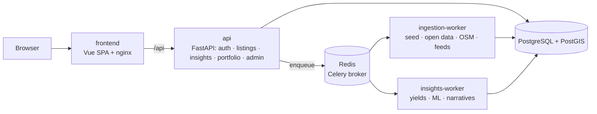

# NeighborIQ

[](https://github.com/e-choness/neighboriq/actions/workflows/ci-cd.yml)
[](LICENSE)

**Rental-property analysis for small investors in Canadian cities.** For any listing — or any property you
found elsewhere — NeighborIQ answers three questions:

1. **Is the price fair?** Asking price against the nearest comparable listings, with the comparables shown.
2. **Will it cash-flow?** A monthly cash flow under Canadian rules (semi-annual mortgage compounding, CMHC
   insurance, land transfer tax) where every assumption is yours to change.
3. **What is the neighbourhood like?** Census income and tenure, transit frequency, crime, new supply and
   nearby amenities, from public open data.


| Listing analysis | Analyze any property |
|---|---|
|  |  |

> **What is real.** Out of the box the app runs on **synthetic demo listings** (clearly labelled
> everywhere) so it works without a data licence. Real listings need a licensed feed (e.g. CREA's DDF® via a
> brokerage) — NeighborIQ does not scrape MLS® or REALTOR.ca. Neighbourhood data, assessment rolls, rates and
> transit come from public open data you load with one command. See [Data sources](docs/data-sources.md) and
> [Methodology](docs/methodology.md).

## Quick start

Requires Docker with Compose v2.

```bash
git clone https://github.com/e-choness/neighboriq.git && cd neighboriq
cp .env.example .env            # set ADMIN_EMAILS to your email
docker compose up -d            # migrates the schema and loads demo data on first start
```

Open **http://localhost**. Sign up with the email in `ADMIN_EMAILS` to get the admin page, where you can load
open data for a city (boundaries, assessment rolls, census, transit, crime, permits) and national rates.

| URL | What |
|---|---|
| http://localhost | Web app |
| http://localhost:8000/docs | API reference (Swagger) |

## Architecture


```mermaid
flowchart LR
    Browser --> Web["frontend<br/>Vue SPA + nginx"]
    Web -->|/api| API["api<br/>FastAPI: auth · listings · insights · portfolio · admin"]
    API --> PG[("PostgreSQL + PostGIS")]
    API -->|enqueue| Redis[("Redis<br/>Celery broker")]
    Redis --> IW["ingestion-worker<br/>seed · open data · OSM · feeds"]
    Redis --> AW["insights-worker<br/>yields · ML · narratives"]
    IW --> PG
    AW --> PG
```

One HTTP service for everything request/response, and two Celery workers for the batch work that actually
needs to scale. Why this split: [architecture overview](docs/architecture/overview.md) and
[ADR 0001](docs/adr/0001-one-api-two-workers.md).

**Stack:** Python 3.11 · FastAPI · SQLAlchemy 2 · PostgreSQL 15 + PostGIS · Celery + Redis · XGBoost ·
Vue 3.5 · Vite 8 · Tailwind v4 · Reka UI · Pinia Colada · MapLibre GL + Protomaps · H3

## Documentation

- [Architecture overview](docs/architecture/overview.md) — components, request flow, what scales and why
- [Data model](docs/architecture/data-models.md) — tables and how they relate
- [Methodology](docs/methodology.md) — how every number is computed, and its limits
- [Data sources](docs/data-sources.md) — every public source, licence, and how to load it
- [Operations](docs/operations.md) — migrations, loading data, admins, basemap, backups
- [Deployment](docs/DEPLOYMENT.md) — production on one server with automatic HTTPS
- [Getting started (development)](docs/development/getting-started.md) · [Testing](docs/development/testing.md)
- [Frontend](docs/frontend/overview.md) — pages, components, theming, maps
- Services: [api](docs/services/api.md) · [ingestion-worker](docs/services/ingestion-worker.md) · [insights-worker](docs/services/insights-worker.md)
- [Decision records](docs/adr/) · [Contributing](CONTRIBUTING.md)

## License

Code: [MIT](LICENSE). Third-party data is licensed by its publishers — see [NOTICE](NOTICE).
Estimates are based on asking prices and public data; they are not appraisals or financial advice.
