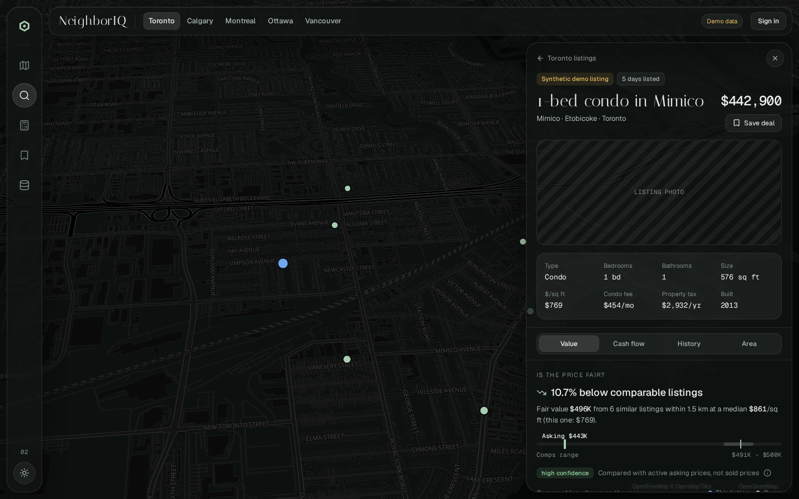
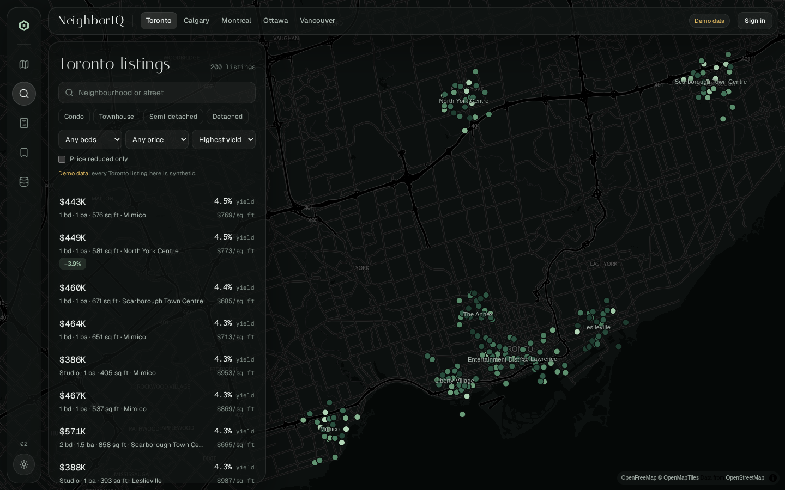
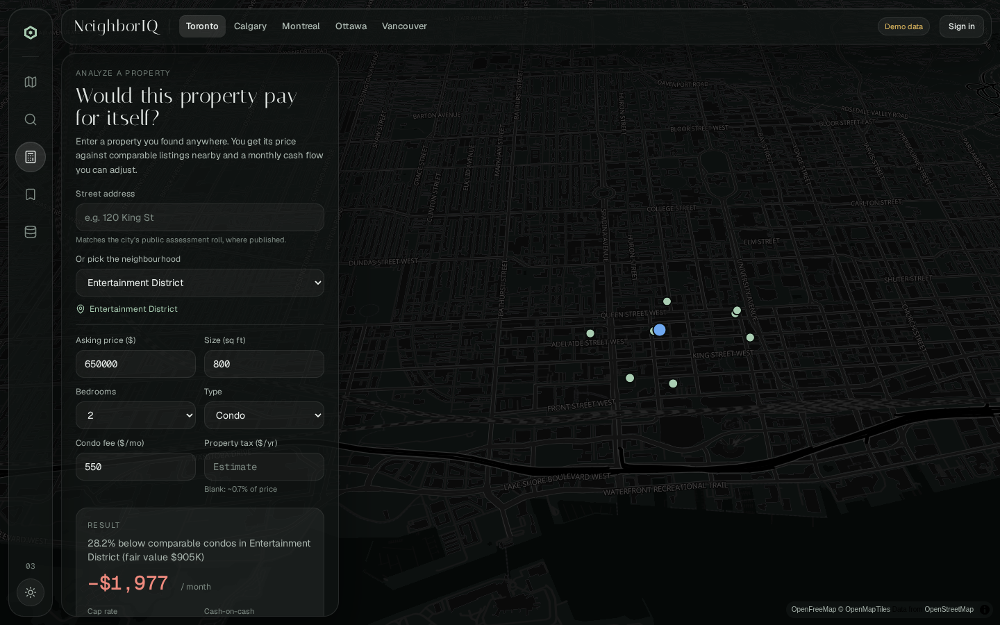
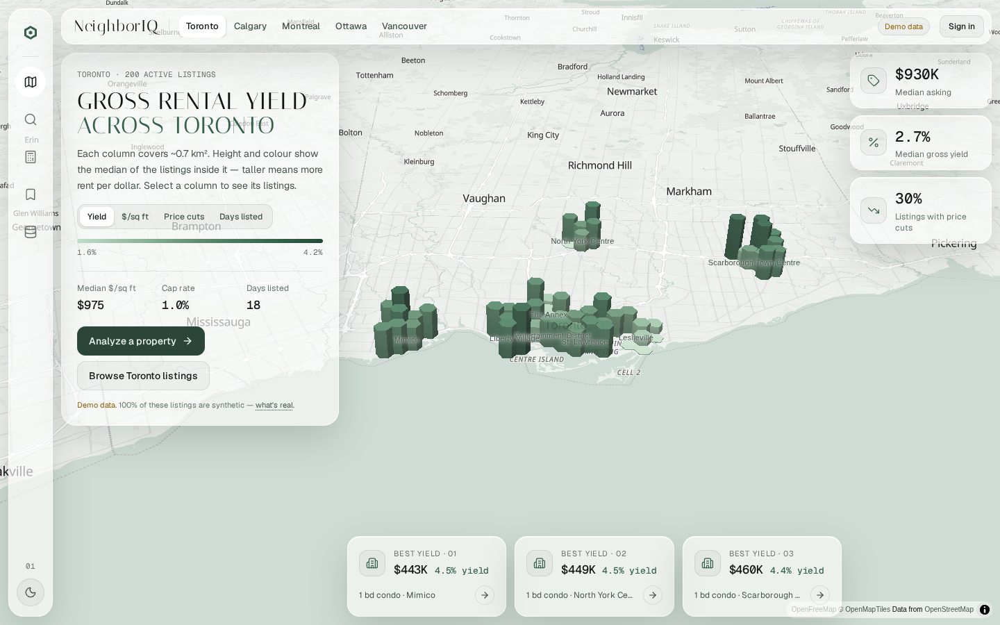
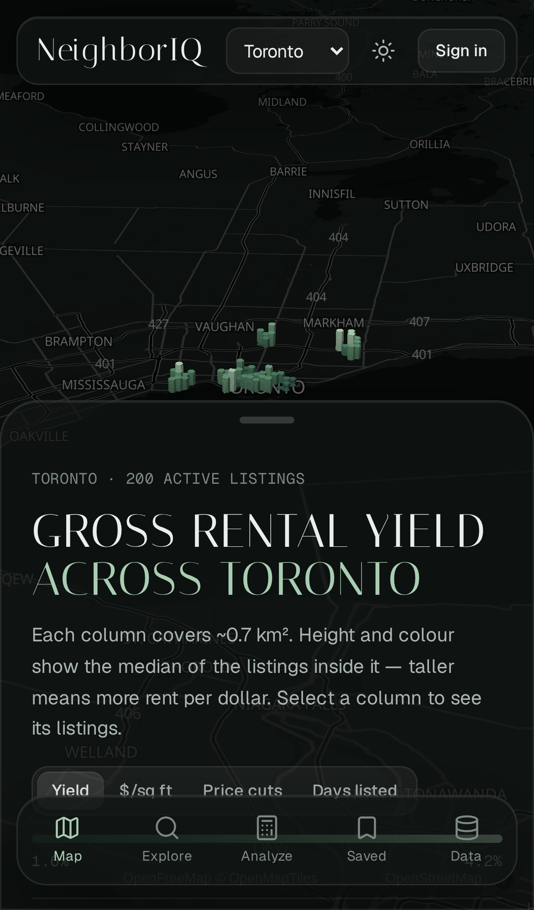
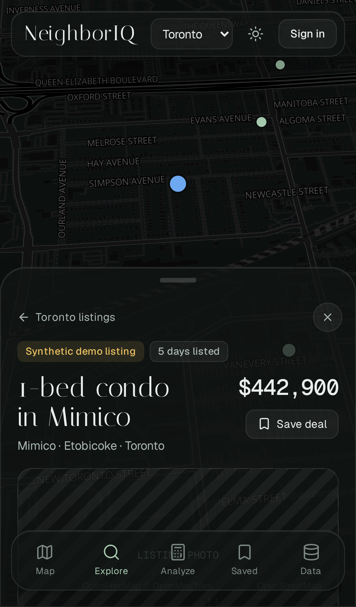
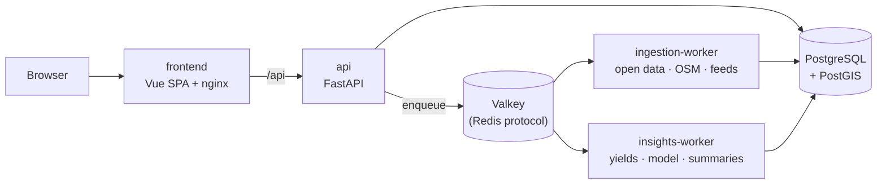

<p align="center">
  <a href="https://e-choness.github.io/NeighborIQ/">
    <picture>
      <source media="(prefers-color-scheme: dark)" srcset="docs/public/media/banner-dark.svg">
      
    </picture>
  </a>
</p>

<p align="center">
  <a href="https://github.com/e-choness/NeighborIQ/actions/workflows/ci-cd.yml"></a>
  <a href="https://github.com/e-choness/NeighborIQ/actions/workflows/docs.yml"></a>
  <a href="https://e-choness.github.io/NeighborIQ/reference/api"></a>
  <a href="LICENSE.md"></a>
  <a href="https://github.com/astral-sh/ruff"></a>
  <a href="https://github.com/e-choness/NeighborIQ/commits/main"></a>
  <br>
  
  
  
  
  
  
</p>

<p align="center">
  <a href="https://e-choness.github.io/NeighborIQ/"><b>Documentation</b></a> ·
  <a href="https://e-choness.github.io/NeighborIQ/guide/calculator">Try the cash-flow calculator</a> ·
  <a href="https://e-choness.github.io/NeighborIQ/reference/api">API reference</a> ·
  <a href="#quick-start">Quick start</a>
</p>

---

**NeighborIQ helps a small investor screen a rental property in a Canadian city.** For any listing, or any
property you found elsewhere, it answers three questions:

| | Question | How |
|---|---|---|
| 1 | **Is the price fair?** | Asking price against the median $/sq ft of the nearest comparable listings, with the comps on a map and a confidence level |
| 2 | **Will it cash-flow?** | Monthly cash flow under Canadian rules (semi-annual compounding, CMHC insurance, land transfer tax), with every assumption editable |
| 3 | **What is the neighbourhood like?** | Census income and tenure, transit frequency, crime, new supply and assessed values, from public open data, each with source and date |

<p align="center">
  
  <br><sub>A 50-second tour on the demo data: <b>Map</b> → <b>Explore</b> → <b>Listing</b> (value, cash flow) → <b>Analyze</b> → light theme.</sub>
</p>

<table>
  <tr>
    <td width="50%"><br><sub><b>Map</b>: one metric per ~0.7 km² column, city medians, the best yields</sub></td>
    <td width="50%"><br><sub><b>Listing</b>: fair value, cash flow, history and area in tabs; comps on the map</sub></td>
  </tr>
  <tr>
    <td width="50%"><br><sub><b>Explore</b>: filters and a list, in sync with the dots on the map</sub></td>
    <td width="50%"><br><sub><b>Analyze</b>: any address or neighbourhood, result pinned beside the map</sub></td>
  </tr>
</table>

<p align="center">
  
  
  
  <br><sub>Light and dark themes; on phones the panels become a bottom sheet over the map.</sub>
</p>

> [!NOTE]
> **What is real.** The app runs on **synthetic demo listings** out of the box. They are labelled everywhere, so
> no data licence is needed. Real listings need a licensed feed (for example CREA's DDF® through a brokerage);
> NeighborIQ does not scrape MLS® or REALTOR.ca. Neighbourhood data, rates and transit come from public open
> data you load with one command. See [Data sources](docs/data-sources.md) and [Methodology](docs/methodology.md).

## Quick start

Requires Docker with Compose v2.

```bash
git clone https://github.com/e-choness/NeighborIQ.git && cd NeighborIQ
cp .env.example .env            # set ADMIN_EMAILS to your email
docker compose up -d            # migrates the schema and loads demo data on first start
```

| URL | What |
|---|---|
| http://localhost | Web app. Sign up with your `ADMIN_EMAILS` address to get the Admin page |
| http://localhost:8000/docs | Interactive API (Swagger) |

Then load open data for a city from the Admin page, or run
`docker compose exec ingestion-worker python -m ingestion opendata --city Vancouver`.

<details>
<summary><b>Production</b>: one server, automatic HTTPS</summary>

```bash
# .env: DOMAIN, POSTGRES_PASSWORD, ADMIN_EMAILS, JWT_PRIVATE_KEY/JWT_PUBLIC_KEY (see docs/DEPLOYMENT.md)
docker compose -f docker-compose.yml -f docker-compose.prod.yml up -d --build
```

Caddy obtains certificates for `$DOMAIN`; nothing but ports 80/443 is exposed. See
[Deployment](docs/DEPLOYMENT.md) and [Operations](docs/operations.md).

</details>

## How it works


```mermaid
flowchart LR
    Browser --> Web["frontend<br/>Vue SPA + nginx"]
    Web -->|/api| API["api<br/>FastAPI"]
    API --> PG[("PostgreSQL<br/>+ PostGIS")]
    API -->|enqueue| Redis[("Valkey<br/>(Redis protocol)")]
    Redis --> IW["ingestion-worker<br/>open data · OSM · feeds"]
    Redis --> AW["insights-worker<br/>yields · model · summaries"]
    IW --> PG
    AW --> PG
```

One HTTP service handles everything request/response. The two Celery workers carry the batch work that
actually needs to scale. See the [architecture overview](docs/architecture/overview.md).

<details>
<summary><b>Stack</b></summary>

| Layer | Choice |
|---|---|
| API | Python 3.14, FastAPI, SQLAlchemy 2, Pydantic 2, RS256 JWT in HttpOnly cookies, Argon2id passwords |
| Data | PostgreSQL 18 + PostGIS 3.6, Alembic migrations |
| Jobs | Celery with Valkey (Redis-compatible) as broker; Scrapy for licensed partner feeds |
| Analytics | Comparable-listing valuation, Canadian cash flow, XGBoost with a backtested error band (off by default) |
| Frontend | Vue 3.5, Vite 8, Tailwind CSS v4, Reka UI, Pinia Colada, MapLibre GL (OpenFreeMap basemap, optional self-hosted PMTiles), H3; Playwright tests |
| Docs | VitePress, published to GitHub Pages |
| Tooling | Ruff, pytest, vue-tsc, pip-audit + npm audit, Dependabot, SHA-pinned GitHub Actions, Caddy |

</details>

## Documentation

The full documentation is at **[e-choness.github.io/NeighborIQ](https://e-choness.github.io/NeighborIQ/)**. It is
built from [`docs/`](docs/), so every page also reads on GitHub:

- **Use it:** [Introduction](docs/guide/index.md) · [Methodology](docs/methodology.md) · [Data sources](docs/data-sources.md)
- **Run it:** [Deployment](docs/DEPLOYMENT.md) · [Operations](docs/operations.md)
- **Build on it:** [Architecture](docs/architecture/overview.md) · [Data model](docs/architecture/data-models.md) ·
  [Frontend](docs/frontend/overview.md) · [Development setup](docs/development/getting-started.md) ·
  [Testing](docs/development/testing.md)

## Status

- [x] Listing search, comparable-listing fair value, Canadian cash flow, portfolio with saved assumptions
- [x] Open-data loaders for boundaries, assessment rolls, census, GTFS transit, crime, permits and rates (6 cities + national)
- [x] Single API + two workers, Alembic-owned schema, CI with lint, tests and an API contract check
- [ ] Verify every open-data source against its live portal (only Bank of Canada is verified so far)
- [ ] Replace placeholder rent benchmarks with the official CMHC table
- [ ] Fuzzy address search (`pg_trgm`)
- [ ] A licensed listing feed

See the [changelog](CHANGELOG.md) for what changed and when.

## Contributing

Issues and pull requests are welcome. Start with [CONTRIBUTING.md](CONTRIBUTING.md). To report a security issue,
see [SECURITY.md](SECURITY.md).

## License

Copyright © 2025-2026 Beili (Echo) Yin. **All rights reserved.** The source is visible, but no licence is
granted to use, copy, modify, host or distribute it without written permission; see [LICENSE.md](LICENSE.md).

see [NOTICE](NOTICE). Estimates rely on asking prices and public data. They are not appraisals or financial
advice.
