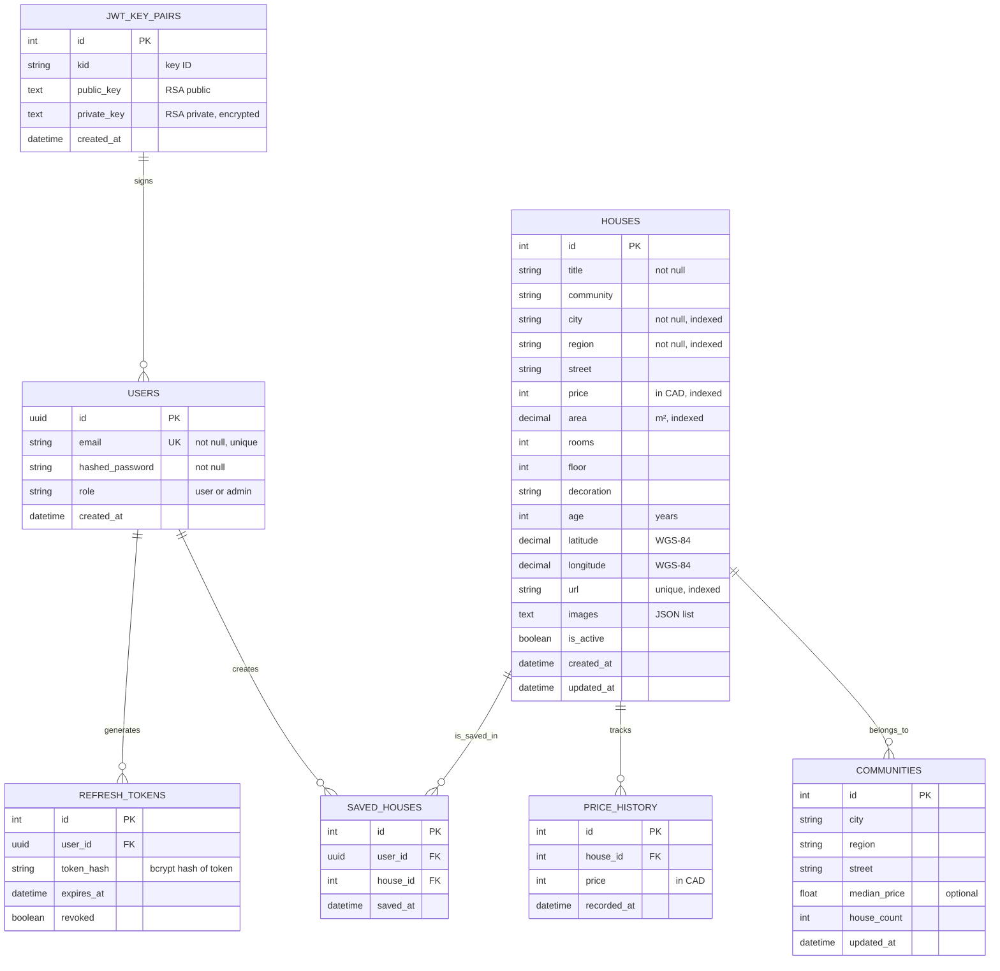

# Data Models & Schema

## Introduction

NeighborIQ uses a **single PostgreSQL database** (`house_discovery`) with **domain-prefixed tables** to maintain clear separation of concerns while avoiding the operational complexity of database-per-service patterns.

All tables use integer primary keys except `auth_users` (UUID) for external API contracts. Timestamps use UTC with server defaults.

---

## Entity Relationship Diagram



---

## Table Reference

### `auth_users`

Stores user accounts and authentication credentials.

| Column | Type | Nullable | Constraint | Description |
|--------|------|----------|-----------|-------------|
| `id` | UUID | ✗ | PRIMARY KEY | User identifier (e.g., `550e8400-e29b-41d4-a716-446655440000`) |
| `email` | VARCHAR(255) | ✗ | UNIQUE, indexed | User email address (login identifier) |
| `hashed_password` | VARCHAR(255) | ✗ | — | bcrypt hash of password |
| `role` | VARCHAR(20) | ✓ | DEFAULT 'user' | Authorization role: `user` or `admin` |
| `created_at` | TIMESTAMP | ✗ | DEFAULT now() | Account creation timestamp |

**Indexes**:
- `auth_users_email_uk` (unique)

**Relationships**:
- `1-N` with `auth_refresh_tokens` (user generates many refresh tokens)
- `1-N` with `portfolio_saved_houses` (user saves many houses)

---

### `auth_jwt_key_pairs`

Stores RS256 key pairs for JWT signing and JWKS publication.

| Column | Type | Nullable | Constraint | Description |
|--------|------|----------|-----------|-------------|
| `id` | INTEGER | ✗ | PRIMARY KEY | Key pair identifier |
| `kid` | VARCHAR(64) | ✗ | — | Key ID (used in JWT header) |
| `public_key` | TEXT | ✗ | — | RSA public key (PEM format) |
| `private_key` | TEXT | ✗ | — | RSA private key (PEM format, encrypted in production) |
| `created_at` | TIMESTAMP | ✗ | DEFAULT now() | Creation timestamp |

**Purpose**: The API Gateway fetches the `public_key` via the JWKS endpoint (`/.well-known/jwks.json`) to verify JWT signatures. Private key is used by Auth Service to sign tokens.

---

### `auth_refresh_tokens`

Stores refresh token metadata for token rotation and revocation.

| Column | Type | Nullable | Constraint | Description |
|--------|------|----------|-----------|-------------|
| `id` | INTEGER | ✗ | PRIMARY KEY | Token record identifier |
| `user_id` | UUID | ✗ | FK `auth_users.id` | User who owns the token |
| `token_hash` | VARCHAR(255) | ✗ | UNIQUE | bcrypt hash of the refresh token |
| `expires_at` | TIMESTAMP | ✗ | indexed | Token expiration time (UTC) |
| `revoked` | BOOLEAN | ✗ | DEFAULT false | Revocation flag (manual logout) |

**Rationale**: Hash of token is stored (never plaintext) so that even if the table is compromised, tokens remain unexposed. Expiration is checked in both the DB and JWT signature.

---

### `house_houses`

Core property listing data.

| Column | Type | Nullable | Constraint | Description |
|--------|------|----------|-----------|-------------|
| `id` | INTEGER | ✗ | PRIMARY KEY, indexed | Property identifier |
| `title` | VARCHAR(255) | ✗ | indexed | Property title/description |
| `community` | VARCHAR(255) | ✓ | indexed | Neighborhood name |
| `city` | VARCHAR(100) | ✗ | indexed | City (e.g., `toronto`, `vancouver`) |
| `region` | VARCHAR(100) | ✗ | indexed | Region/district within city |
| `street` | VARCHAR(255) | ✓ | — | Street address |
| `price` | INTEGER | ✗ | indexed | Price in CAD |
| `area` | NUMERIC(10,2) | ✓ | indexed | Living area in m² |
| `rooms` | INTEGER | ✓ | — | Number of bedrooms |
| `floor` | INTEGER | ✓ | — | Floor number |
| `decoration` | VARCHAR(50) | ✓ | — | Finish type (精装, 简装, etc.) |
| `age` | INTEGER | ✓ | — | Building age in years |
| `latitude` | NUMERIC(10,8) | ✓ | indexed | WGS-84 latitude for geo-spatial queries |
| `longitude` | NUMERIC(11,8) | ✓ | indexed | WGS-84 longitude for geo-spatial queries |
| `url` | VARCHAR(512) | ✓ | UNIQUE, indexed | Source URL |
| `images` | TEXT | ✓ | — | JSON array of image URLs |
| `is_active` | INTEGER | ✗ | DEFAULT 1 | Soft delete flag (1=active, 0=inactive) |
| `created_at` | TIMESTAMP | ✗ | DEFAULT now() | Insertion timestamp |
| `updated_at` | TIMESTAMP | ✗ | DEFAULT now() | Last modification timestamp |

**Indexes**:
- `idx_house_houses_city_region` — composite index on (city, region) for filtered queries
- `idx_house_houses_price` — price range queries
- `idx_house_houses_location` — composite (latitude, longitude) for geo-spatial queries

---

### `house_price_history`

Tracks price changes over time.

| Column | Type | Nullable | Constraint | Description |
|--------|------|----------|-----------|-------------|
| `id` | INTEGER | ✗ | PRIMARY KEY | History record identifier |
| `house_id` | INTEGER | ✗ | FK `house_houses.id` | Property being tracked |
| `price` | INTEGER | ✗ | indexed | Price in CAD at this timestamp |
| `recorded_at` | TIMESTAMP | ✗ | indexed | When the price was recorded |

**Rationale**: Enables historical price tracking for trend analysis. A new record is inserted whenever the price changes.

---

### `house_communities`

Community-level aggregated data.

| Column | Type | Nullable | Constraint | Description |
|--------|------|----------|-----------|-------------|
| `id` | INTEGER | ✗ | PRIMARY KEY | Community identifier |
| `city` | VARCHAR(100) | ✗ | indexed | City |
| `region` | VARCHAR(100) | ✗ | indexed | Region |
| `street` | VARCHAR(255) | ✓ | — | Street (optional, for granular communities) |
| `median_price` | FLOAT | ✓ | — | Median price in community (CAD) |
| `house_count` | INTEGER | ✗ | DEFAULT 0 | Number of properties in community |
| `updated_at` | TIMESTAMP | ✗ | DEFAULT now() | Last refresh timestamp |

**Purpose**: Provides pre-aggregated community statistics for dashboard displays without scanning the entire `house_houses` table.

---

### `portfolio_saved_houses`

User-saved houses (watchlist / portfolio).

| Column | Type | Nullable | Constraint | Description |
|--------|------|----------|-----------|-------------|
| `id` | INTEGER | ✗ | PRIMARY KEY | Record identifier |
| `user_id` | UUID | ✗ | FK `auth_users.id`, indexed | User who saved |
| `house_id` | INTEGER | ✗ | FK `house_houses.id`, indexed | Saved property |
| `saved_at` | TIMESTAMP | ✗ | DEFAULT now() | When the save occurred |

**Indexes**:
- Composite unique index on (user_id, house_id) to prevent duplicates

---

## Elasticsearch Index

The `houses` index mirrors key fields from `house_houses` for fast full-text and geo-spatial search:

```json
{
  "mappings": {
    "properties": {
      "id": { "type": "keyword" },
      "title": { "type": "text", "analyzer": "standard" },
      "community": { "type": "keyword" },
      "city": { "type": "keyword" },
      "region": { "type": "keyword" },
      "price": { "type": "float" },
      "area": { "type": "float" },
      "rooms": { "type": "integer" },
      "location": { "type": "geo_point" },
      "ai_score": { "type": "float" }
    }
  }
}
```

**Field Mapping**:
| ES Field | Postgres Field | Purpose |
|----------|---|---------|
| `id` | `house_houses.id` | Document identifier |
| `title` | `house_houses.title` | Full-text indexed for keyword search |
| `community` | `house_houses.community` | Keyword filter |
| `city` | `house_houses.city` | Keyword filter |
| `region` | `house_houses.region` | Keyword filter |
| `price` | `house_houses.price` | Numeric range filtering |
| `area` | `house_houses.area` | Numeric range filtering |
| `rooms` | `house_houses.rooms` | Numeric range filtering |
| `location` | (latitude, longitude) | Geo-distance queries |
| `ai_score` | (computed) | AI ranking score for featured results |

---

## Shared Library Usage

All SQLAlchemy models are defined in `shared/models/` and imported by services:

```python
from shared import (
    House,           # ORM model for house_houses
    User,            # ORM model for auth_users
    Community,       # ORM model for house_communities
    HousePriceHistory,
    JWTKeyPair,
    RefreshToken,
    SavedHouse,      # ORM model for portfolio_saved_houses
    get_db,          # Async session factory
    init_db,         # Initialize tables
)
```

Each service imports only what it needs. The shared module handles SQLAlchemy configuration, session management, and model registration.

---

## Alembic Migrations

Database schema changes are managed via Alembic (stored in `migrations/alembic/`):

```bash
# View migration history
docker-compose exec api-gateway python -m alembic history

# Upgrade to latest revision
docker-compose exec api-gateway python -m alembic upgrade head

# Create a new migration
docker-compose exec api-gateway python -m alembic revision --autogenerate -m "add new column"
```

All migrations are applied during service startup (see `init_db()` in `shared/__init__.py`).

---

## Foreign Key & Cascading Rules

| Parent | Child | Rule | Rationale |
|--------|-------|------|-----------|
| `auth_users` | `auth_refresh_tokens` | CASCADE DELETE | Revoke all tokens when user is deleted |
| `auth_users` | `portfolio_saved_houses` | CASCADE DELETE | Clear saved houses when user is deleted |
| `house_houses` | `house_price_history` | CASCADE DELETE | Remove price history when property is deleted |
| `house_houses` | `portfolio_saved_houses` | CASCADE DELETE | Auto-remove from watchlists when property is delisted |

---

## Design Principles

1. **Domain Separation** — Tables are prefixed by domain (`auth_*`, `house_*`, `portfolio_*`) to prevent accidental cross-service queries
2. **Scalability** — All heavily-queried fields are indexed; composite indexes support common filter combinations
3. **Immutability of Core Data** — Purchase prices and timestamps are never modified; price changes create new `price_history` records
4. **Soft Deletes** — `house_houses.is_active` allows recovery without violating foreign key constraints
5. **Cache-Friendly** — Primary keys and filter columns support Redis cache naming schemes (e.g., `house:{id}`)
