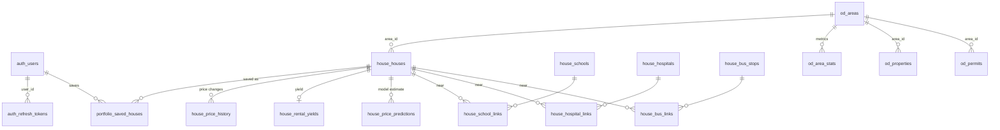

# Data model

One PostgreSQL 15 database with PostGIS. Alembic owns the schema
([`migrations/alembic/versions`](../../migrations/alembic/versions)); ORM models for the application tables live
in [`shared/models`](../../shared/models). The open-data tables (`od_*`) are written with SQL by the ingestion
worker and read with SQL by the API, so they have no ORM classes.

| Migration | Adds |
|---|---|
| `001_initial_schema` | auth, listings, communities, amenities and their link tables |
| `002_ai_tables_and_postgis` | predictions, rental yields, market insights; PostGIS extension |
| `003_canadian_listing_model` | Canadian listing fields (postal code, type, sq ft, fees, tax, status, source, `is_synthetic`), price history, rent benchmarks |
| `004_portfolio_saved_houses` | saved listings with notes and cash-flow assumptions |
| `005_open_data` | `od_*` tables, `house_houses.area_id`, GTFS frequency on stops |

```mermaid
erDiagram
    auth_users ||--o{ auth_refresh_tokens : "user_id"
    auth_users ||--o{ portfolio_saved_houses : saves
    house_houses ||--o{ portfolio_saved_houses : "saved as"
    house_houses ||--o{ house_price_history : "price changes"
    house_houses ||--o| house_rental_yields : "yield"
    house_houses ||--o{ house_price_predictions : "model estimate"
    house_houses ||--o{ house_school_links : near
    house_houses ||--o{ house_hospital_links : near
    house_houses ||--o{ house_bus_links : near
    house_schools ||--o{ house_school_links : ""
    house_hospitals ||--o{ house_hospital_links : ""
    house_bus_stops ||--o{ house_bus_links : ""
    od_areas ||--o{ house_houses : "area_id"
    od_areas ||--o{ od_area_stats : metrics
    od_areas ||--o{ od_properties : "area_id"
    od_areas ||--o{ od_permits : "area_id"
```

`house_rent_benchmarks`, `house_market_insights`, `house_communities`, `od_census_points`, `od_indicators`,
`od_load_log` and `auth_jwt_keys` stand alone (joined by city, bedrooms, series or location, not by keys).

## Accounts

| Table | Key columns | Notes |
|---|---|---|
| `auth_users` | `id` (int), `email` (unique), `password_hash` (bcrypt), `role` (`user`/`admin`), `is_active` | Role `admin` is granted at sign-up when the email is in `ADMIN_EMAILS` |
| `auth_refresh_tokens` | `user_id`, `token_hash` (SHA-256, unique), `expires_at`, `is_revoked` | Rotated on every refresh; the raw token is never stored |
| `auth_jwt_keys` | `key_id`, `private_key_pem`, `public_key_pem`, `is_active` | Development only; production supplies `JWT_PRIVATE_KEY`/`JWT_PUBLIC_KEY` |

## Listings

`house_houses` is one row per listing, keyed by `url` (stable per source).

| Group | Columns |
|---|---|
| Location | `city`, `region` (district), `community` (neighbourhood), `street`, `postal_code`, `latitude`, `longitude`, `area_id` → `od_areas` |
| Property | `property_type` (`condo`/`townhouse`/`semi`/`detached`), `rooms` (bedrooms; 0 = bachelor), `bathrooms`, `sqft`, `area` (m², derived), `parking`, `floor`, `age`, `decoration` |
| Money | `price` (asking, CAD), `condo_fee` (monthly), `property_tax` (annual) |
| Lifecycle | `status` (`active`/`sold`/`expired`/`withdrawn`), `listed_at`, `is_active`, `created_at`, `updated_at` |
| Provenance | `source` (`seed`, `import`, or the name given to a feed job), `is_synthetic` (1 for demo data — shown as a label in the UI) |

- `house_price_history` — one row per observed price; the writer appends a row when the price changes. The
  listings API derives `original_price` and price cuts from it.
- `house_communities` — per-neighbourhood aggregates (count, average/min/max price), refreshed by the writer.
- `house_schools`, `house_hospitals`, `house_bus_stops` — amenities from OpenStreetMap (`osm_id` = `node/123`)
  or GTFS (`osm_id` = `gtfs:<feed>:<stop_id>`, with `weekday_departures`). The `*_links` tables hold the
  distance in metres from a listing to nearby amenities.

## Analytics

| Table | Written by | Contents |
|---|---|---|
| `house_rent_benchmarks` | `bootstrap` / `ingestion rents` | Average rent by `city` × `bedrooms` (0–3+), with `source` and `survey_date` |
| `house_rental_yields` | insights-worker | Estimated annual rent, gross and net yield per listing (default assumptions) |
| `house_price_predictions` | insights-worker, only with a backtested model | Point estimate plus low/high from backtest residual quantiles |
| `house_market_insights` | insights-worker | Per-city narrative built only from computed statistics; `expires_at` 7 days |

The fair-value comps and the cash flow shown on a listing are computed per request and not stored — see
[Methodology](../methodology.md).

## Portfolio

`portfolio_saved_houses`: `user_id`, `house_id` (unique together), `notes`, `assumptions` (JSON text: the
cash-flow inputs the user last analysed the listing with), timestamps.

## Open data

| Table | Grain | Contents |
|---|---|---|
| `od_areas` | neighbourhood polygon | `city`, `name`, `code`, `geom` (MultiPolygon 4326, GiST), centroid, `area_km2` |
| `od_area_stats` | area × metric × period | Long format: census (median income, rent paid, renter share, population), transit departures/km², crime counts and rates, permits, listing medians. Primary key `(area_id, metric, period)` |
| `od_census_points` | dissemination area | Representative point, population, `values` JSONB; spatially joined to areas |
| `od_properties` | assessment-roll record | Address, class, zoning, year built, units, floor area, land/improvement/assessed values, tax levy; unique `(source, source_id)` |
| `od_permits` | building permit | Issue date, kind, units, value, location, `area_id` |
| `od_indicators` | series × date | Time series such as Bank of Canada `boc:V80691335` (5-year conventional mortgage rate) |
| `od_load_log` | load run | Source key, row count, licence, attribution, status and message — the provenance shown on the Data page |

Area metrics use a long table so a new source adds rows, not columns. The API pivots them per area
(`/api/v1/areas/{id}`) and exposes the list of metrics it has for a city.

## Conventions

- Integer surrogate keys everywhere; money in whole CAD as integers; rates as decimals (`0.0523`).
- Timestamps are `timestamptz`.
- Tables are prefixed by domain (`auth_`, `house_`, `portfolio_`, `od_`), a leftover of the multi-service design
  that is kept because it groups tables well.
- Change the schema only through a new Alembic revision; `AUTO_CREATE_SCHEMA=1` (`create_all`) exists for tests
  and throwaway dev databases.
