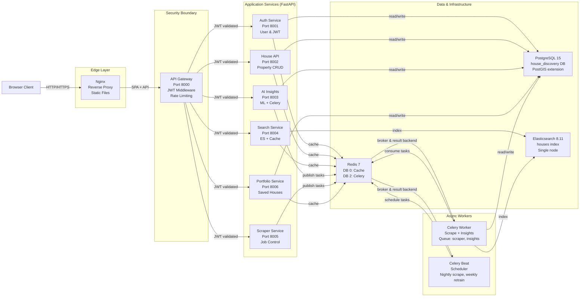
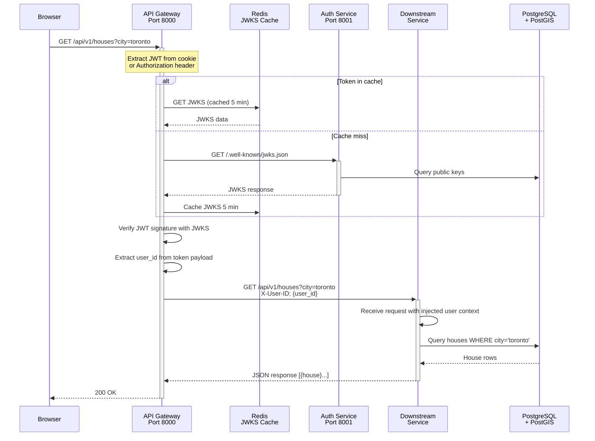

# System Architecture

## Introduction & Design Rationale

NeighborIQ is built as a **microservices system** to achieve several key objectives:

1. **Separation of Concerns** — Each service owns a single domain (auth, properties, search, ML, data ingestion) with clear boundaries
2. **Independent Scaling** — Services like Search or AI Insights can scale independently based on load
3. **Resilience** — Failure of one service (e.g., Elasticsearch) doesn't take down the entire platform
4. **Developer Productivity** — Teams can work on services independently without coordination
5. **Technology Diversity** — Services can use the best tool for their job (FastAPI for APIs, Scrapy for scraping, Celery for async jobs)

The architecture emphasizes **shared infrastructure** (single Postgres DB, shared Redis, Elasticsearch) to avoid the operational burden of distributed databases while maintaining clear service boundaries through domain-specific schemas.

---

## Service Interaction Diagram



---

## Request Lifecycle Sequence

A typical request flows through the system as follows:



---

## Service Responsibilities

| Service | Port | Primary Responsibility | Key Dependencies |
|---------|------|------------------------|------------------|
| **API Gateway** | 8000 | Request boundary, JWT middleware, rate limiting, reverse proxy | Auth Service (JWKS), all downstream services |
| **Auth Service** | 8001 | User registration/login, RS256 JWT generation, JWKS endpoint | PostgreSQL, Redis (sessions) |
| **House API Service** | 8002 | Property CRUD, community data, filtering, pagination | PostgreSQL, Redis (cache) |
| **Search Service** | 8004 | Full-text + geo-spatial search via Elasticsearch, Redis caching | Elasticsearch, Redis |
| **AI Insights Service** | 8003 | ML price prediction (XGBoost), rental yield analysis, Celery tasks | PostgreSQL, Redis (Celery broker) |
| **Scraper Service** | 8005 | Data ingestion control API, Celery task distribution | Celery (Redis), PostgreSQL |
| **Portfolio Service** | 8006 | User saved houses / watchlist, auth-gated | PostgreSQL, Redis (cache) |

---

## Infrastructure Layer

### PostgreSQL 15 + PostGIS 3.4

A single shared PostgreSQL database (`house_discovery`) with domain-prefixed tables maintains clear separation of concerns:

- **Auth Domain**: `auth_users`, `auth_jwt_key_pairs`, `auth_refresh_tokens`
- **House Domain**: `house_houses`, `house_price_history`, `house_communities`
- **Portfolio Domain**: `portfolio_saved_houses`

PostGIS extension enables geographic queries (distance calculations, spatial indexing).

**Rationale**: Single database simplifies operational complexity while domain prefixes + schema separation prevent accidental cross-service coupling.

### Redis 7

Redis serves multiple roles via database partitioning:

- **DB 0** — Cache namespace for search results, house data, user sessions (high churn, short TTL)
- **DB 2** — Celery broker (task queue) for scraper and AI insight workers

**Cache Key Namespaces**:
- `house:{id}` — single house document (24h TTL)
- `community:{city}:{region}:{street}` — community metadata (7d TTL)
- `search:query:{hash}` — search result set (30m TTL)

### Elasticsearch 8.11

Single-node Elasticsearch cluster hosts the `houses` index (production should use ≥3 nodes). The index enables:

- **Full-text search** on property titles and descriptions
- **Keyword filters** on city, region, community
- **Numeric ranges** on price, area, rooms
- **Geo-spatial queries** via `geo_point` location field

Index is populated by the scraper pipeline and kept in sync with PostgreSQL via cache invalidation.

### Nginx (Production Only)

In production, Nginx serves as:
- **Static file server** for the Vue 3 SPA
- **Reverse proxy** to the API Gateway (TLS termination, request logging)
- **Load balancer** (multiple Gateway instances)

---

## Docker Network Topology

All services communicate over a single bridge network (`neighbor_iq_net`) defined in `docker-compose.yml`. Service-to-service communication uses DNS names (e.g., `auth-service:8000`), not IP addresses.

**Network Layout**:
```
neighbor_iq_net (bridge)
├── postgres:5432
├── redis:6379
├── elasticsearch:9200
├── api-gateway:8000
├── auth-service:8001
├── house-api-service:8002
├── search-service:8004
├── portfolio-service:8006
├── ai-insights-service:8003
├── scraper-service:8005
├── ai-insights-worker (no port)
├── ai-insights-beat (no port)
├── scraper-worker (no port)
├── scraper-beat (no port)
├── frontend (nginx):80
└── (test containers, only with --profile test)
```

All services depend on infrastructure (Postgres, Redis, Elasticsearch) using health checks to ensure startup order.

---

## Cross-References

- See [**API Gateway**](../services/api-gateway.md) for JWT middleware and rate limiting details
- See [**Auth Service**](../services/auth-service.md) for RS256 key generation and JWKS endpoint
- See [**Data Models**](./data-models.md) for the complete database schema
- See [**Getting Started Guide**](../development/getting-started.md) for Docker Compose startup
