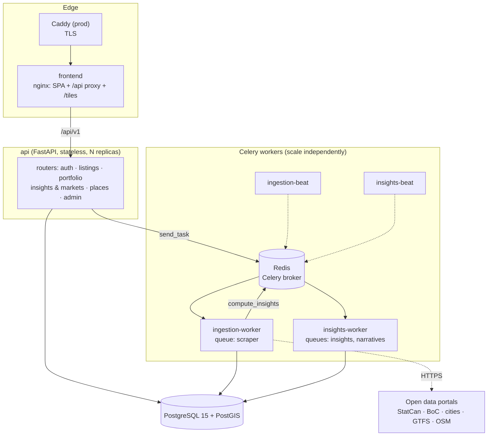
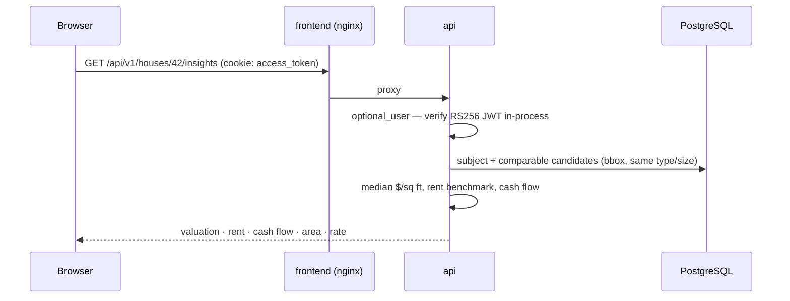

# Architecture

NeighborIQ is one HTTP service plus two background workers, sharing one PostgreSQL database.

```mermaid
flowchart TB
    subgraph edge["Edge"]
        Caddy["Caddy (prod)<br/>TLS"] --> Web["frontend<br/>nginx: SPA + /api proxy + /tiles"]
    end
    Web -->|/api/v1| API

    subgraph api["api (FastAPI, stateless, N replicas)"]
        API["routers: auth · listings · portfolio<br/>insights & markets · places · admin"]
    end

    API --> PG[("PostgreSQL 15 + PostGIS")]
    API -->|send_task| Redis[("Redis<br/>Celery broker")]

    subgraph workers["Celery workers (scale independently)"]
        IW["ingestion-worker<br/>queue: scraper"]
        AW["insights-worker<br/>queues: insights, narratives"]
        IB["ingestion-beat"] -.-> Redis
        AB["insights-beat"] -.-> Redis
    end
    Redis --> IW & AW
    IW --> PG
    AW --> PG
    IW -->|compute_insights| Redis
    IW -. HTTPS .-> OD["Open data portals<br/>StatCan · BoC · cities · GTFS · OSM"]
```

| Deployable | Code | Does | Scales on |
|---|---|---|---|
| `api` | [`services/api`](../../services/api) | Every HTTP endpoint: auth, listing search, fair value, cash flow, markets, open-data reads, admin job dispatch | Request rate (stateless; add replicas) |
| `ingestion-worker` | [`services/ingestion-worker`](../../services/ingestion-worker) | Seed data, open-data loads, OSM amenities, partner listing feeds | Size and number of data loads |
| `insights-worker` | [`services/insights-worker`](../../services/insights-worker) | Yields for new/changed listings, model backtest + retrain, market summaries | Listings changed, model size |
| `*-beat` | same images | Schedules: daily rates, weekly OSM refresh and retrain, nightly narratives | — (exactly one each) |
| `migrate`, `bootstrap` | ingestion image | One-shot: `alembic upgrade head`, then demo data on first start | — |
| `frontend` | [`frontend`](../../frontend) | Static SPA, `/api` proxy, `/tiles` (PMTiles) | CDN-cacheable |

## Why one API and two workers

The system used to be seven HTTP services behind a gateway, all sharing one database and one `shared/` package —
the costs of microservices (header-trust between services, port wiring, per-service images) without independent
deploys. The components were ranked by how likely they are to need independent scaling:

| Rank | Component | Load profile | Decision |
|---|---|---|---|
| 1 | **Ingestion** (seed, open data, OSM, feeds) | Bursty, network-bound, large files (assessment rolls, GTFS, census), third-party rate limits; failures must not affect users | **Separate worker** |
| 2 | **Insights compute** (yields, ML training, narratives, optional LLM calls) | CPU/memory heavy, large dependencies (XGBoost), different release cadence | **Separate worker** |
| 3 | Search | Read-heavy; becomes its own engine only if relevance or volume demands it | In the API (Postgres); see [ADR 0002](../adr/0002-search-in-postgres.md) |
| 4 | Map aggregates / tiles | Read-heavy, cacheable | Static PMTiles + client-side H3; CDN when needed |
| 5 | Listings, valuation, cash flow endpoints | Light per request (indexed queries, <10 ms arithmetic) | In the API |
| 6 | Portfolio, auth, admin | Low volume | In the API |

The two workers are the scale-out units; the API scales by replicas. Module boundaries inside the API
(one router per domain, shared code only via `shared/`) keep a later extraction cheap. See
[ADR 0001](../adr/0001-one-api-two-workers.md).

## Request flow

```mermaid
sequenceDiagram
    participant B as Browser
    participant N as frontend (nginx)
    participant A as api
    participant P as PostgreSQL
    B->>N: GET /api/v1/houses/42/insights (cookie: access_token)
    N->>A: proxy
    A->>A: optional_user — verify RS256 JWT in-process
    A->>P: subject + comparable candidates (bbox, same type/size)
    A->>A: median $/sq ft, rent benchmark, cash flow
    A-->>B: valuation · rent · cash flow · area · rate
```

No service trusts identity headers: every protected route verifies the token itself (`app/security.py`).

## Data flow

1. `bootstrap` loads rent benchmarks and synthetic listings; `ingestion-worker` loads open data on demand.
2. Every listing write records price history and enqueues `compute_insights`.
3. `insights-worker` writes `house_rental_yields` (and model predictions if a backtested model exists).
4. The API serves listings, comps, cash flow and area metrics from Postgres.

## Infrastructure

- **PostgreSQL 15 + PostGIS** — the only store. Schema owned by Alembic (`migrations/`); services never
  create tables in Compose (`AUTO_CREATE_SCHEMA=0`).
- **Redis** — Celery broker only.
- **Networking** — only `frontend` (and Caddy in prod) publish public ports; `api`, Postgres and Redis bind to
  localhost in development and nothing in production.

## Related

- [Data model](data-models.md) · [Methodology](../methodology.md) · [Data sources](../data-sources.md)
- [Operations](../operations.md) · [Deployment](../DEPLOYMENT.md)
