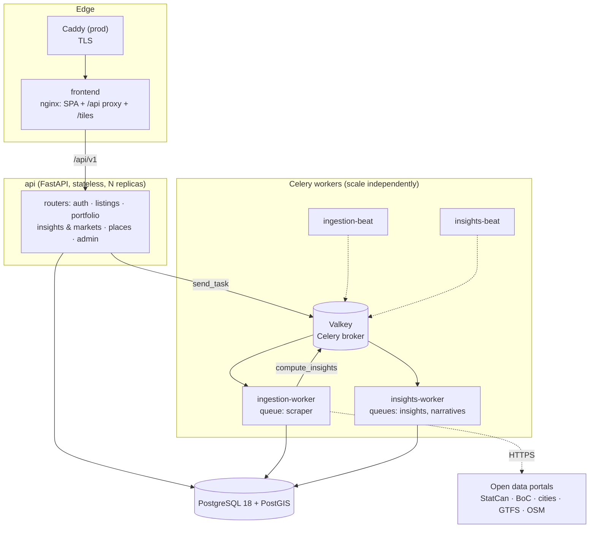
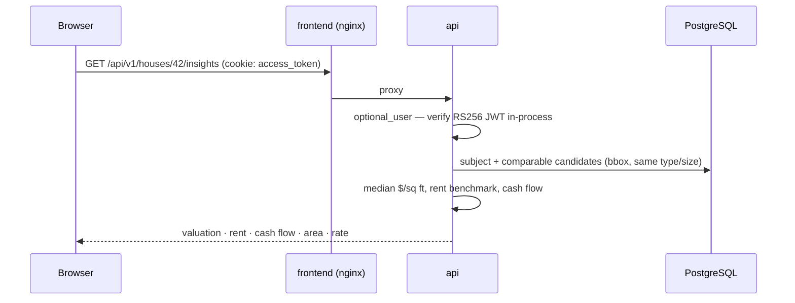

# Architecture

NeighborIQ is one HTTP service plus two background workers, sharing one PostgreSQL database.

| Deployable | Code | Does | Scales on |
|---|---|---|---|
| `api` | [`services/api`](../../services/api) | Every HTTP endpoint: auth, listing search, fair value, cash flow, markets, open-data reads, admin job dispatch | Request rate (stateless; add replicas) |
| `ingestion-worker` | [`services/ingestion-worker`](../../services/ingestion-worker) | Seed data, open-data loads, OSM amenities, partner listing feeds | Size and number of data loads |
| `insights-worker` | [`services/insights-worker`](../../services/insights-worker) | Yields for new/changed listings, model backtest + retrain, market summaries | Listings changed, model size |
| `*-beat` | same images | Schedules: daily rates, weekly OSM refresh and retrain, nightly narratives | — (exactly one each) |
| `migrate`, `bootstrap` | ingestion image | One-shot: `alembic upgrade head`, then demo data on first start | — |
| `frontend` | [`frontend`](../../frontend) | Static SPA, `/api` proxy, `/tiles` (optional PMTiles) | CDN-cacheable |

## Scaling

The API is stateless and scales by adding replicas. The two workers scale independently of it and of each
other; each `*-beat` scheduler runs exactly once. Inside the API there is one router per domain, and code
is shared only through `shared/`. See [Deployment → Scaling](../self-hosting/deployment.md#scaling).

## Request flow

No service trusts identity headers: every protected route verifies the token itself (`app/security.py`).

## Data flow

1. `bootstrap` loads rent benchmarks and synthetic listings; `ingestion-worker` loads open data on demand.
2. Every listing write records price history and enqueues `compute_insights`.
3. `insights-worker` writes `house_rental_yields` (and model predictions if a backtested model exists).
4. The API serves listings, comps, cash flow and area metrics from Postgres.

## Infrastructure

- **PostgreSQL 18 + PostGIS 3.6** — the only store. Schema owned by Alembic (`migrations/`); services never
  create tables in Compose (`AUTO_CREATE_SCHEMA=0`).
- **Valkey 9** (the BSD-licensed, Redis-compatible fork; Compose service `redis`) — Celery broker only.
- **Networking** — only `frontend` (and Caddy in prod) publish public ports; `api`, Postgres and Redis bind to
  localhost in development and nothing in production.

## Related

- [Data model](data-model.md) · [Methodology](../guide/methodology.md) · [Data sources](../guide/data-sources.md)
- [Operations](../self-hosting/operations.md) · [Deployment](../self-hosting/deployment.md)
