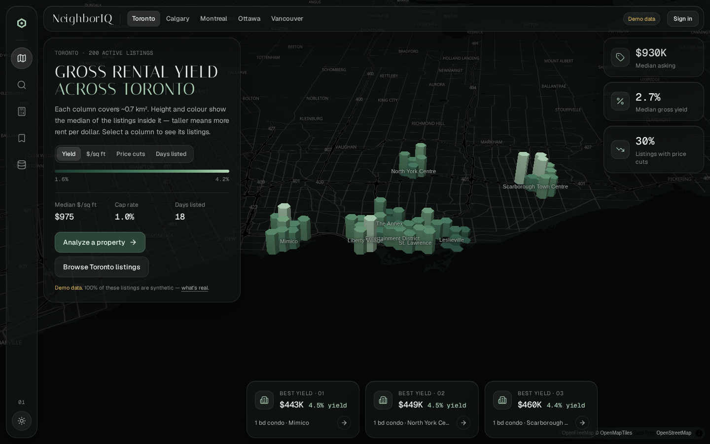

# Frontend

Vue 3.5 single-page app in [`frontend/`](../../frontend), built with Vite 8 and served by nginx, which also
proxies `/api` to the API and serves `/tiles/`.

| Concern | Choice |
|---|---|
| Styling | Tailwind CSS v4 (`@tailwindcss/vite`), design tokens as CSS variables in `src/styles/app.css` |
| Components | Reka UI primitives, wrapped shadcn-style in `src/components/ui` (source lives in the repo) |
| Server state | Pinia Colada (`useQuery`/`useMutation`: caching, dedupe, invalidation) |
| Client state | Pinia: `auth`, `city` (top-bar city, mirrored in `?city=`), `mapStage` (what the map shows), `shell` (phone sheet snap, toast, last Explore filters) |
| Routing | Vue Router 5, lazy-loaded pages, `meta.layout` per route |
| Maps | MapLibre GL 6 on a hosted OpenFreeMap style by default (or self-hosted Protomaps PMTiles), H3 (`h3-js`) for hexagon aggregation |
| Icons, type | Lucide; Geist and Geist Mono for UI and figures; Italiana for the wordmark and screen titles (all self-hosted) |
| Tests | Playwright (`e2e/`) at 1440×900 and iPhone 14, API mocked from demo-data fixtures |



## Map-first shell

One MapLibre map (`components/map/MapStage.vue`) is mounted once in `App.vue` and stays behind every primary
route; content lives in docked glass sheets, so the map keeps its context while you read. Only sheet
interiors scroll — the page itself never does.

| Layout (`meta.layout`) | Routes | Sheet (desktop ≥ 1024px) |
|---|---|---|
| `map-left` | `/`, `/explore`, `/analyze` | 400px on the left, beside the 64px rail |
| `map-right` | `/listings/:id` | 480px on the right |
| `map-center` | `/portfolio`, `/data` | full width, max 1040px content, map dimmed behind |
| `plain` | `/login` | no map or shell |

- **Desktop:** glass rail on the left (`AppRail`), glass top bar (`AppTopBar`) with the wordmark, the city and
  the account. Home adds floating stat tiles (≥ 1100px) and a best-yields row (≥ 1280px); narrower, they move
  into the sheet.
- **Phones (< 1024px):** a bottom tab bar (`MobileTabBar`) and a bottom sheet with three snaps — peek
  `min(250px, 40dvh)`, half `56dvh`, full `100dvh − 108px`. Tap the grabber to cycle, drag it more than 30px to
  move one snap, Escape collapses to peek. Home, Explore and Listing open at half; Analyze, Portfolio and Data
  at full. The map pads its bottom by the sheet height, so data stays visible above it.

The map's modes (`stores/mapStage.ts`), set by each page:

| Mode | Screens | Shows |
|---|---|---|
| `home` | Home, Analyze without a place | 3D hex columns (height and colour = metric), pitch 58°, slow orbit |
| `explore` | Explore | Listing dots coloured by gross yield, flat; row hover ↔ dot ring; "Search this area" after a pan |
| `listing` | Listing, Analyze with a place | Subject and comparables at street level (pitch 48°); comp row hover ↔ map ring; no hex columns |
| `overview` | Portfolio, Data | Hex columns at 55% behind a scrim, saved listings as dots |

## Pages

| Route | Page | For the visitor |
|---|---|---|
| `/` | Home | The city on the hex map with one metric at a time (yield, $/sq ft, price cuts, days listed), city medians and the three best-yield listings. Selecting a column opens Explore for that area |
| `/explore` | Explore | Search, type chips, beds / price / sort and price-cut filters over a list of listings, in sync with the dots on the map. Filters live in the URL |
| `/listings/:id` | Listing | Badges, title, price and Save; photo; facts; then tabs (`?tab=`): **Value** (fair value, comps list that highlights on the map, model estimate), **Cash flow** (editable), **History**, **Area** (market context, neighbourhood). Back and close return to Explore with its filters |
| `/analyze` | Analyze | The same analysis for a property found elsewhere, with the result pinned in the sheet and every assumption in a dialog (phones: in the full sheet) |
| `/portfolio` | Portfolio | Saved listings, recomputed with the assumptions they were saved with |
| `/data` | Data | Sources & methodology; admins also get the **Admin** tab (coverage, load jobs, load history). `/admin` redirects to `/data?tab=admin` |

Principles: show numbers people act on (price vs. comps, monthly cash flow, yield, what the neighbourhood is
like), say where each number comes from, and label demo data as demo data. Every assumption is an input,
not a hidden constant.

## Components

- `components/shell` — `AppRail`, `AppTopBar`, `MobileTabBar`, `Sheet` (docked panel / phone bottom sheet), `nav.ts`.
- `components/map` — `MapStage` (the one map: `hex`, `hex-hover`, `pts`, `pts-hl`, `comps`, `comps-hl` layers).
- `components/ui` — Button, Badge, Panel, Stat, Segmented (toggle group), SliderField, Field, InfoTip, Skeleton.
- `components/analysis` — `FairValue`, `CashFlowPanel`, `PriceHistory`, `NeighbourhoodFacts`.
- `components/data` — `AdminPanel` (the Data screen's Admin tab).
- `lib/` — `api.ts` (fetch wrapper with cookie auth and refresh), `map.ts` (basemap choice and fallback,
  tint, map factory, ramps, fit padding), `hex.ts` (H3 aggregation), `metrics.ts`, `format.ts` (CAD,
  percentages), `theme.ts` (dark/light, reduced motion), `viewport.ts` (breakpoints).

## Colour

Two files hold all colour:

- [`src/styles/app.css`](../../frontend/src/styles/app.css) — UI tokens for dark and light: surfaces, ink,
  border, sage accent (`--accent`, `--accent-deep` for primary buttons), glass (`--panel`, `--border-strong`,
  `--glass-hi`, `--shadow`), `--seg-on`, `--bar`, `--scrim`. The `.glass` utility is for floating panels only
  (rail, top bar, sheets, tiles, tooltips, tab bar) — never nested; inner cards use `bg-surface-2`.
- [`src/theme/palette.ts`](../../frontend/src/theme/palette.ts) — map and data colours: the hosted-basemap
  tint and PMTiles flavour, the sequential ramp (magnitude), the diverging pair (below/above fair value),
  subject and comp markers.

The basemap is low contrast, so the data layers carry the contrast. Current values:

| Role | Dark | Light |
|---|---|---|
| Basemap earth / water | `#0c100f` / `#050807` | `#eef2ef` / `#cfdbd5` |
| Sequential (low → high, sage) | `#1d3a2e #2a5140 #3b6a53 #548868 #7aab86 #b3d7b8` | `#c3dcc8 #8fb698 #5f8a6c #3b6a50 #244a36` |
| Diverging below / above | `#a9cdb2` / `#f08a7e` | `#35604a` / `#b3372d` |
| Subject / comp markers | `#6ea8f0` / `#a9cdb2` | `#2a78d6` / `#35604a` |
| Glass panel | `rgb(16 20 19 / 0.75)` | `rgb(250 252 251 / 0.66)` |

`npm run check:palette` validates them: adjacent ramp steps are ΔE ≥ 0.035 apart (OKLab) in normal,
protan, deutan and tritan vision and ordered by lightness; the strongest step and both markers reach 3:1
against the basemap earth; subject and comp stay ΔE ≥ 0.08 apart in every vision type; text, secondary and
muted text reach 4.5:1 on the glass over the basemap ground and its brightest area. Colour is never the only
channel: the hex map encodes the metric in height too, and verdicts carry text labels.

## Maps

- MapLibre 6 is ESM-only and imported by name. Its worker is loaded through Vite
  (`maplibre-gl-worker.mjs?worker&url` + `setWorkerUrl`, `worker.format: 'es'`).
- Basemap: `VITE_PMTILES_URL` set → the self-hosted Protomaps file; otherwise `VITE_BASEMAP` (default
  `hosted`: OpenFreeMap `dark` / `positron`, overridable with `VITE_BASEMAP_STYLE_DARK` / `_LIGHT`, tinted
  to the palette by `tintBasemap`); `none` draws data on the plain background. If a hosted style has not
  arrived 12 s after the map is created, the map falls back to data only and shows "Basemap unreachable —
  showing data only". See [Operations → Basemap](../self-hosting/operations.md#basemap).
- The map container is watched with a `ResizeObserver` (MapLibre measures a container mounted before layout
  as 400×300). Fit padding is clamped so at least 120px of map remains (`fitPadding`), and missing sprite
  images are replaced with a transparent pixel.
- The home map orbits slowly until the user interacts (and resumes after 10 s); `prefers-reduced-motion`
  stops the orbit, `flyTo`/`fitBounds` animation and the sheet animation.
- Market points come from `/api/v1/markets/{city}/points` as compact arrays and are aggregated into H3 cells
  in the browser. Neighbourhood names are HTML markers (no basemap glyphs needed), hidden on phones and at
  street level.

## Commands

```bash
npm run dev          # Vite dev server on :5173, proxies /api to :8000 (VITE_API_PROXY to change)
npm run typecheck    # vue-tsc
npm run lint         # ESLint (typescript-eslint + eslint-plugin-vue)
npm run build        # typecheck + production build to dist/
npm run test:e2e     # Playwright against `vite preview` of a VITE_E2E build, API mocked
npm run check:palette
```

In Docker (the supported way to run them):

```bash
docker compose --profile test run --rm test-frontend-build
docker compose --profile test run --rm test-frontend-e2e              # CI_NETWORK=1 to also test the hosted basemap
```

Screenshots and the walkthrough are regenerated from a running stack; see
[Testing → Screenshots and walkthrough](testing.md#screenshots-and-walkthrough).
