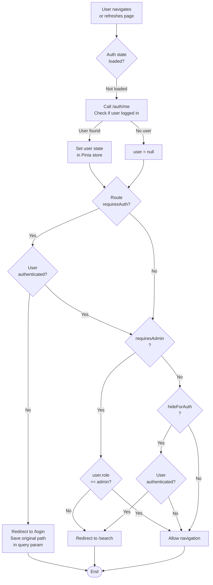
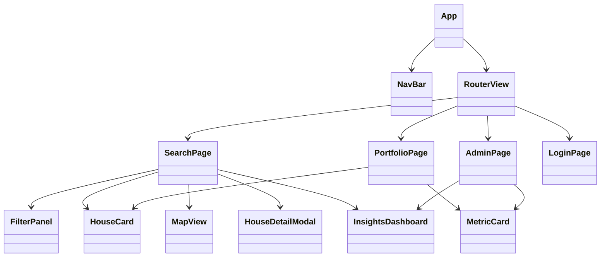

# Frontend Architecture

## Introduction

The NeighborIQ frontend is a **Vue 3 single-page application (SPA)** built with **TypeScript**, **Tailwind CSS** for styling, **Pinia** for state management, and **OpenLayers** for interactive maps. The app is compiled and served via **Nginx** in production.

**Tech Stack**:
- **Framework**: Vue 3 (Composition API)
- **Language**: TypeScript
- **Styling**: Tailwind CSS
- **State**: Pinia stores (type-safe, modular)
- **Maps**: OpenLayers 7+
- **Build Tool**: Vite (fast dev server + optimized builds)
- **HTTP Client**: Axios with cookie-based auth
- **Package Manager**: npm

---

## Router Navigation Guard Logic



**Route Meta Definitions**:

```typescript
interface RouteConfig {
  path: string;
  name: string;
  component: () => Promise<Component>;
  meta: {
    requiresAuth?: boolean;      // Requires JWT token
    requiresAdmin?: boolean;      // Requires admin role
    hideForAuth?: boolean;        // Hide from logged-in users
  };
}
```

---

## Component Hierarchy



---

## Page Inventory

| Route | Component File | Auth Required | Admin Only | Purpose |
|-------|----------------|---------------|-----------|---------|
| `/search` | `SearchPage.vue` | ✗ | ✗ | Public property browsing, filtering, map, saved houses |
| `/portfolio` | `PortfolioPage.vue` | ✓ | ✗ | User's saved houses with metrics |
| `/admin` | `AdminPage.vue` | ✓ | ✓ | Admin dashboard for scraper jobs, insights |
| `/login` | `LoginPage.vue` | ✗ (hidden) | ✗ | Login/signup form |
| `/` | — | — | — | Redirect to `/search` |

---

## Component Reference

| Component | File | Props | Emits | Purpose |
|-----------|------|-------|-------|---------|
| **NavBar** | `NavBar.vue` | — | — | Top navigation with auth links |
| **SearchPage** | `SearchPage.vue` | — | — | Main search interface |
| **FilterPanel** | `FilterPanel.vue` | `initialFilters` | `@filter-change` | Filter controls (city, price, rooms) |
| **HouseCard** | `HouseCard.vue` | `house`, `showSaveButton` | `@house-click`, `@save-click` | Single property card |
| **MapView** | `MapView.vue` | `houses`, `center` | `@pin-click` | OpenLayers map with property pins |
| **HouseDetailModal** | `HouseDetailModal.vue` | `house` | `@close`, `@save` | Property details overlay |
| **InsightsDashboard** | `InsightsDashboard.vue` | `city`, `region` | — | ML predictions, rental yield charts |
| **MetricCard** | `MetricCard.vue` | `title`, `value`, `trend` | — | KPI display card |
| **PortfolioPage** | `PortfolioPage.vue` | — | — | User's saved houses list |
| **AdminPage** | `AdminPage.vue` | — | — | Scraper job control, error logs |
| **LoginPage** | `LoginPage.vue` | — | — | Auth form (login/signup tabs) |

---

## Pinia Store Reference

### Auth Store

**File**: `src/stores/auth.ts`

**State**:
```typescript
{
  user: User | null;           // Current user or null
  loading: boolean;            // Fetch in progress
  error: string | null;        // Last error message
}
```

**Computed**:
```typescript
isAuthenticated    // user !== null
isAdmin            // user?.role === 'admin'
```

**Actions**:
```typescript
checkAuth()        // Call GET /auth/me to restore session
login(credentials) // POST /auth/login, set user
signup(credentials)// POST /auth/signup, set user
logout()           // POST /auth/logout, clear user
```

**Usage**:
```typescript
const authStore = useAuthStore()

// In template
<div v-if="authStore.isAuthenticated">{{ authStore.user.email }}</div>

// In script
await authStore.login({ email, password })
if (authStore.isAdmin) { /* show admin menu */ }
```

---

## API Service Layer

**File**: `src/services/api.ts`

Axios HTTP client with pre-configured baseURL and cookie handling:

```typescript
// Automatically includes cookies in requests
const apiClient = axios.create({
  baseURL: process.env.VITE_API_BASE_URL || 'http://localhost:8000',
  withCredentials: true,  // Include HttpOnly cookies
  headers: {
    'Content-Type': 'application/json',
  },
})

// Service-specific clients
const authApi = {
  login(creds) { return apiClient.post('/api/v1/auth/login', creds) },
  signup(creds) { return apiClient.post('/api/v1/auth/signup', creds) },
  logout() { return apiClient.post('/api/v1/auth/logout') },
  me() { return apiClient.get('/api/v1/auth/me') },
}

const houseApi = {
  list(filters) { return apiClient.get('/api/v1/houses', { params: filters }) },
  get(id) { return apiClient.get(`/api/v1/houses/${id}`) },
}

const searchApi = {
  search(query) { return apiClient.get('/api/v1/search', { params: query }) },
  nearby(lat, lon, radius) { /* geo search */ },
}

const portfolioApi = {
  list() { return apiClient.get('/api/v1/portfolio') },
  save(houseId) { return apiClient.post('/api/v1/portfolio', { house_id: houseId }) },
  remove(houseId) { return apiClient.delete(`/api/v1/portfolio/${houseId}`) },
}
```

---

## TypeScript Types

**File**: `src/types/`

Core type definitions used across components:

```typescript
// User & Auth
export interface User {
  id: string;        // UUID
  email: string;
  role: 'user' | 'admin';
  created_at: string;
}

export interface LoginCredentials {
  email: string;
  password: string;
}

// Property
export interface House {
  id: number;
  title: string;
  community: string;
  city: string;
  region: string;
  price: number;      // CAD
  area: number;       // m²
  rooms: number;
  latitude: number;
  longitude: number;
  created_at: string;
}

// Search
export interface SearchQuery {
  q?: string;
  city?: string;
  price_min?: number;
  price_max?: number;
  page?: number;
  page_size?: number;
}

// Insights
export interface HouseInsights {
  house_id: number;
  predicted_price: number;
  confidence: number;
  annual_rent: number;
  gross_yield: number;
  net_yield: number;
}
```

---

## Build Configuration

**Vite Config** (`vite.config.ts`):

```typescript
export default defineConfig({
  plugins: [vue()],
  server: {
    proxy: {
      '/api': {
        target: 'http://localhost:8000',
        changeOrigin: true,
        secure: false,
      }
    }
  },
  build: {
    outDir: 'dist',
    target: 'es2020',
  }
})
```

**Development**:
```bash
npm run dev  # Vite dev server @ http://localhost:5173
```

**Production Build**:
```bash
npm run build  # Outputs to dist/
```

---

## Nginx Configuration (Production)

**File**: `frontend/nginx.conf`

```nginx
server {
    listen 80;
    server_name _;
    
    # Serve static files from dist/
    root /usr/share/nginx/html;
    
    # SPA fallback: redirect all 404s to index.html for client-side routing
    error_page 404 /index.html;
    location / {
        try_files $uri $uri/ /index.html;
    }
    
    # Cache static assets (js, css, images)
    location ~* \.(js|css|png|jpg|jpeg|gif|svg)$ {
        expires 30d;
        add_header Cache-Control "public, immutable";
    }
    
    # Proxy API requests to gateway
    location /api/ {
        proxy_pass http://api-gateway:8000;
        proxy_set_header X-Forwarded-For $remote_addr;
        proxy_set_header X-Forwarded-Proto $scheme;
    }
}
```

---

## Environment Variables

**File**: `.env` (or `.env.local` for local overrides)

```env
# API Base URL
VITE_API_BASE_URL=http://localhost:8000

# Map tiles provider (optional)
VITE_MAP_TILES=https://{s}.tile.openstreetmap.org/{z}/{x}/{y}.png

# Google Analytics (optional)
VITE_GA_ID=
```

---

## Troubleshooting

### CORS Error: "Cross-Origin Request Blocked"

**Symptom**: Browser console shows CORS error on API requests

**Root Cause**: API Gateway `CORS_ORIGINS` doesn't include frontend URL

**Solution**:
```bash
# Update API Gateway environment
export CORS_ORIGINS="http://localhost:5173,https://neighboriq.com"
docker-compose up -d api-gateway
```

### Auth Redirect Loop

**Symptom**: User redirects to `/login` indefinitely

**Root Cause**: 
- `/auth/me` endpoint returning 401 despite valid token
- Token expired and refresh failed

**Solution**:
1. Check token in browser DevTools → Application → Cookies
2. Manually refresh: `POST /api/v1/auth/refresh`
3. If still failing, log out and log back in

### Map Tiles Not Loading

**Symptom**: OpenLayers shows blank/gray map

**Root Cause**: 
- Tile server URL incorrect
- Network blocked by CORS/firewall

**Solution**:
```typescript
// In MapView.vue
const tileLayer = new TileLayer({
  source: new OSM({
    url: 'https://{a-c}.tile.openstreetmap.org/{z}/{x}/{y}.png'
  })
})
```

---

## See Also

- [**Getting Started Guide**](../development/getting-started.md) — Setup Vite dev server
- [**System Architecture**](../architecture/overview.md) — API contract overview
