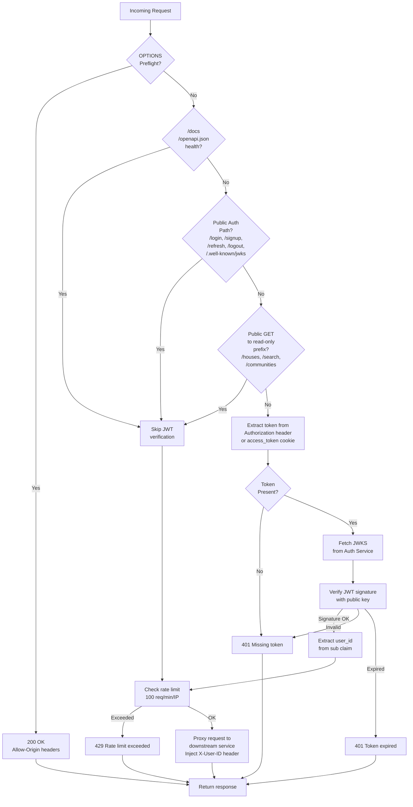
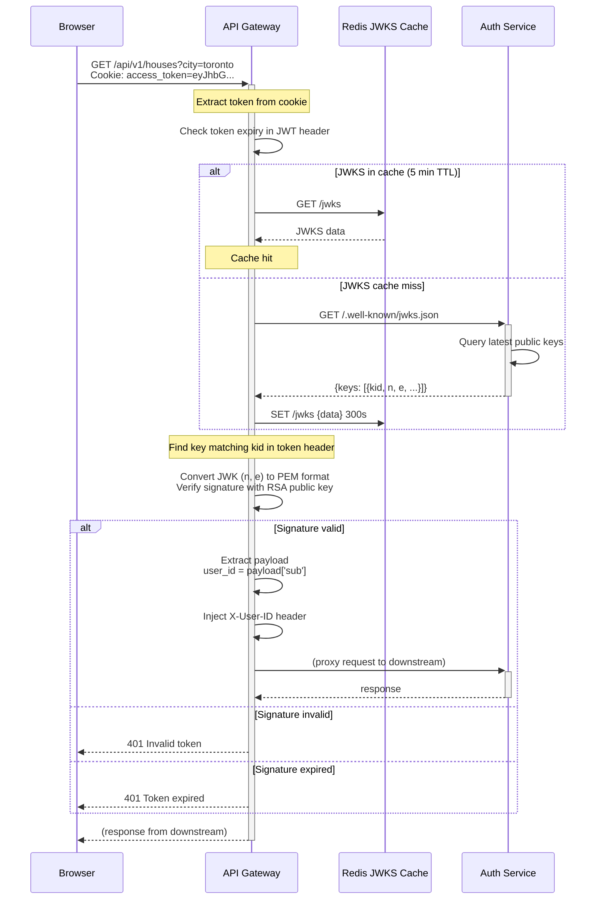

# API Gateway Service

## Introduction & Purpose

The API Gateway serves as the **single ingress point** for all client requests. It functions as a security boundary, implementing:

- **JWT Token Verification** — Validates RS256 signatures against the Auth Service's public keys (JWKS endpoint)
- **Rate Limiting** — Enforces 100 requests per minute per IP address via SlowAPI
- **Request Routing** — Reverse proxies requests to downstream services with proper headers
- **CORS Middleware** — Restricts cross-origin requests to configured frontend origins
- **User Context Injection** — Extracts user ID from JWT and forwards it to downstream services via `X-User-ID` header

The gateway is **stateless** and can be horizontally scaled behind a load balancer.

---

## Routing Decision Logic



---

## JWT Verification Sequence



---

## Public Paths Reference

Requests to these paths **skip JWT verification**:

### Public Authentication Endpoints

| Path | Method | Purpose |
|------|--------|---------|
| `/api/v1/auth/login` | POST | User login (generates access + refresh tokens) |
| `/api/v1/auth/signup` | POST | User registration |
| `/api/v1/auth/refresh` | POST | Refresh access token using refresh cookie |
| `/api/v1/auth/logout` | POST | Revoke tokens and clear cookies |
| `/api/v1/auth/.well-known/jwks.json` | GET | JWKS endpoint (public key discovery) |

### Admin Health Check Endpoints

| Path | Method | Purpose |
|------|--------|---------|
| `/api/v1/admin/health` | GET | Overall system health |
| `/api/v1/auth/health` | GET | Auth service health |
| `/api/v1/houses/health` | GET | House API service health |
| `/api/v1/ai/health` | GET | AI service health |
| `/api/v1/search/health` | GET | Search service health |

### Public Read-Only Endpoints

Unauthenticated **GET** requests to these prefixes are allowed (for public search / discovery pages):

| Prefix | Purpose |
|--------|---------|
| `/api/v1/houses` | List/get properties (public browsing) |
| `/api/v1/communities` | Community data (public browsing) |
| `/api/v1/search` | Search results (public search) |

All other methods (POST, PUT, DELETE, PATCH) require JWT authentication.

### Documentation Routes

| Path | Purpose |
|------|---------|
| `/docs` | Swagger UI (OpenAPI docs) |
| `/openapi.json` | OpenAPI spec |
| `/health` | Gateway health check |
| `/api/v1/routes` | Available routes summary |

---

## Rate Limiting

**SlowAPI Configuration**:
- **Limit**: 100 requests per minute
- **Scope**: Per IP address (`get_remote_address`)
- **Applied to**: All proxy routes (`/api/v1/*`)
- **Response**: `429 Too Many Requests` with `Retry-After` header

Rate limits are per-IP and reset on a rolling window. To bypass (for trusted servers), consider using API keys (future enhancement).

---

## Downstream Proxy Routes

| Path Prefix | Destination Service | Port | Notes |
|-------------|-------------------|------|-------|
| `/api/v1/auth/{path}` | Auth Service | 8001 | User auth operations |
| `/api/v1/houses` | House API Service | 8002 | Property CRUD |
| `/api/v1/communities` | House API Service | 8002 | Community data |
| `/api/v1/search/{path}` | Search Service | 8004 | Full-text search |
| `/api/v1/portfolio/{path}` | Portfolio Service | 8006 | Saved houses |

**Header Injection**: 
- All proxied requests include `X-User-ID: {user_id}` (extracted from JWT)
- Downstream services use this header to enforce user-scoped access control

---

## Environment Variables

| Variable | Default | Purpose |
|----------|---------|---------|
| `AUTH_SERVICE_URL` | `http://auth-service:8000` | Auth Service endpoint |
| `HOUSE_SERVICE_URL` | `http://house-api-service:8000` | House API Service endpoint |
| `SEARCH_SERVICE_URL` | `http://search-service:8000` | Search Service endpoint |
| `PORTFOLIO_SERVICE_URL` | `http://portfolio-service:8000` | Portfolio Service endpoint |
| `AI_INSIGHTS_SERVICE_URL` | `http://ai-insights-service:8000` | AI Service endpoint |
| `CORS_ORIGINS` | `http://localhost:5173` | CORS allowed origins (comma-separated) |

Example for production with multiple origins:
```
CORS_ORIGINS=https://neighboriq.com,https://www.neighboriq.com,https://api.neighboriq.com
```

---

## Error Handling & Troubleshooting

### 503 Service Unavailable (JWKS Endpoint)

**Symptom**: All requests return `503 Unable to fetch JWKS`

**Root Cause**: Auth Service is unreachable or `/api/v1/auth/.well-known/jwks.json` is failing

**Recovery**:
```bash
# Check Auth Service is running
docker-compose ps auth-service

# View logs
docker-compose logs auth-service

# Verify JWKS endpoint directly
curl http://localhost:8001/api/v1/auth/.well-known/jwks.json
```

### 401 Missing Access Token

**Symptom**: Protected endpoint returns `401 Missing access token`

**Root Cause**: Token not in cookie or `Authorization: Bearer` header

**Solution**:
- Ensure browser sends `access_token` cookie (verify with browser DevTools)
- Or explicitly set `Authorization: Bearer {token}` header in API client

### 401 Token Has Expired

**Symptom**: Previously working token returns `401 Token has expired`

**Root Cause**: Access token TTL exceeded (default: 15 minutes)

**Solution**:
```bash
# Refresh the token via the client library
# POST /api/v1/auth/refresh
# Response includes new access_token cookie
```

### 429 Rate Limit Exceeded

**Symptom**: `429 Too Many Requests` after many rapid requests

**Root Cause**: Client exceeded 100 req/min/IP limit

**Solution**:
- Implement exponential backoff in client
- Check for `Retry-After` response header
- For high-volume use cases, contact admin for API key (future enhancement)

### CORS Error from Browser

**Symptom**: Browser console: `Cross-Origin Request Blocked`

**Root Cause**: Frontend origin not in `CORS_ORIGINS`

**Solution**:
```bash
# Update CORS_ORIGINS env var and restart
export CORS_ORIGINS="http://localhost:5173,https://myapp.com"
docker-compose up -d api-gateway
```

---

## Performance Optimization

### JWKS Caching (5 min)

The gateway caches JWKS data in memory for 5 minutes to avoid per-request calls to the Auth Service. This dramatically reduces latency but means key rotation takes up to 5 minutes to propagate.

**When to update the cache TTL**:
- **Shorter TTL (1 min)** — if you rotate keys frequently
- **Longer TTL (10 min)** — if you have very high load and key rotation is rare

### Concurrent Request Handling

FastAPI + `httpx.AsyncClient` enables the gateway to handle thousands of concurrent requests with a single process. For production, run multiple gateway instances behind Nginx.

---

## Deployment Notes

### Single Instance (Development)

```bash
docker-compose up -d api-gateway
```

### Multiple Instances (Production)

```yaml
# Add to docker-compose.yml
api-gateway-1:
  build: services/api-gateway
  ports: "8000:8000"
  environment:
    - AUTH_SERVICE_URL=http://auth-service:8000
    # ... other env vars

api-gateway-2:
  build: services/api-gateway
  ports: "8001:8000"  # Different host port, same container port
  environment:
    - AUTH_SERVICE_URL=http://auth-service:8000
    # ...

# Run Nginx as reverse proxy
nginx:
  image: nginx:alpine
  ports: "80:80"
  volumes:
    - ./nginx.conf:/etc/nginx/nginx.conf:ro
  depends_on:
    - api-gateway-1
    - api-gateway-2
```

Then configure Nginx to round-robin between `api-gateway-1:8000` and `api-gateway-2:8000`.

---

## See Also

- [**Auth Service**](./auth-service.md) — JWKS endpoint, JWT key management
- [**System Architecture**](../architecture/overview.md) — Service topology
- [**Getting Started**](../development/getting-started.md) — Local development setup
