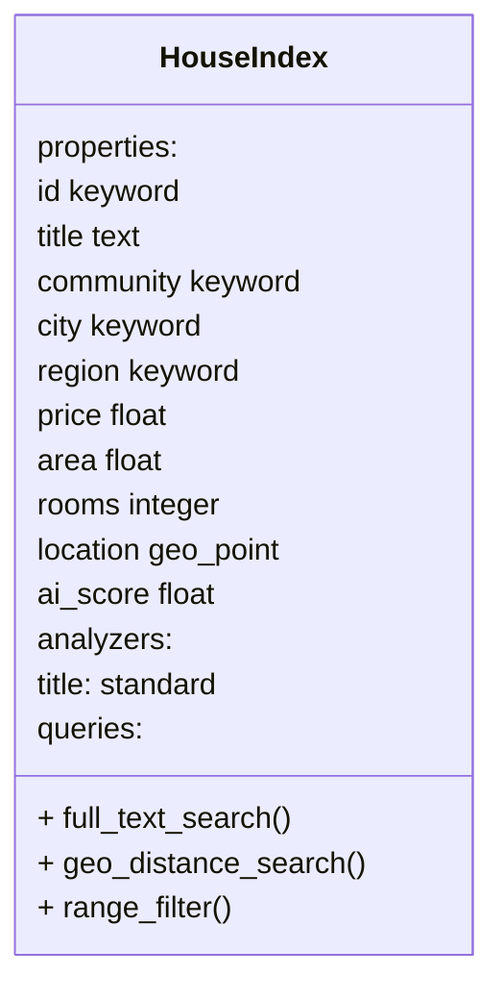

# Search Service

## Introduction

The Search Service provides **high-performance full-text and geo-spatial search** for property listings via Elasticsearch, with **Redis caching** for frequently-accessed search results.

The service is separated from the House API Service to allow independent scaling of search workloads. Elasticsearch enables multi-dimensional queries (title + location + price) that would be inefficient on PostgreSQL with standard indexes.

---

## Cache-Aside Search Flow

```mermaid
flowchart TD
    Request["GET /api/v1/search?q=downtown&price_min=300000"]
    
    Request --> HashQuery["Hash query parameters<br/>SHA256 first 16 chars"]
    
    HashQuery --> CacheKey["Build cache key<br/>search:query:{hash}"]
    
    CacheKey --> CheckCache{"Query in<br/>Redis?"}
    
    CheckCache -->|HIT| ReturnCache["Return cached results<br/>30-min TTL"]
    
    CheckCache -->|MISS| ESQuery["Query Elasticsearch<br/>houses index<br/>Title full-text +<br/>Price/location filters"]
    
    ESQuery --> ESResponse["ES returns<br/>matching houses<br/>sorted by relevance"]
    
    ESResponse --> CacheResult["Cache results in Redis<br/>Key: search:query:{hash}<br/>TTL: 1800s"]
    
    CacheResult --> Return["Return results<br/>to client"]
    
    ReturnCache --> Return
    
    Return --> [*]
```

---

## Elasticsearch Index Mapping



**Field Reference**:

| Field | ES Type | Analyzer | Use Cases |
|-------|---------|----------|-----------|
| `id` | keyword | — | Document ID, exact match |
| `title` | text | standard | Full-text search: "downtown", "4-bedroom" |
| `community` | keyword | — | Exact match: "King West" |
| `city` | keyword | — | Exact match: "toronto" |
| `region` | keyword | — | Exact match: "Downtown" |
| `price` | float | — | Range filter: price >= 300000 AND price <= 800000 |
| `area` | float | — | Range filter: area >= 100 AND area <= 500 |
| `rooms` | integer | — | Exact/range: rooms=3 |
| `location` | geo_point | — | Geo-distance query: distance <= 2km from lat/lon |
| `ai_score` | float | — | Boost: AI-ranked property features |

---

## Full-Text Search

**Endpoint**:
```http
GET /api/v1/search?q=downtown+4+bedroom&city=toronto&price_min=300000
```

**Elasticsearch Query** (simplified):
```json
{
  "query": {
    "bool": {
      "must": [
        {
          "multi_match": {
            "query": "downtown 4 bedroom",
            "fields": ["title^2", "community"]
          }
        }
      ],
      "filter": [
        { "term": { "city": "toronto" } },
        { "range": { "price": { "gte": 300000 } } }
      ]
    }
  }
}
```

**Features**:
- Case-insensitive full-text search on title and community
- Tokenization: "4-bedroom" matches "4 bedroom" and "bedroom"
- Fuzzy matching: "downton" ~matches "downtown"
- Field boosting: title matches weighted higher

---

## Geo-Spatial Search

**Endpoint**:
```http
GET /api/v1/search/nearby?lat=43.6629&lon=-79.3957&radius_km=2&price_min=300000
```

**Elasticsearch Query**:
```json
{
  "query": {
    "bool": {
      "filter": [
        {
          "geo_distance": {
            "distance": "2km",
            "location": {
              "lat": 43.6629,
              "lon": -79.3957
            }
          }
        },
        { "range": { "price": { "gte": 300000 } } }
      ]
    }
  }
}
```

**Response**:
```json
{
  "results": [
    {
      "id": 1,
      "title": "4-BR House near High Park",
      "price": 650000,
      "distance_km": 0.5,
      "location": { "lat": 43.6629, "lon": -79.3957 }
    }
  ],
  "total_count": 34,
  "search_time_ms": 45
}
```

**Parameters**:

| Parameter | Type | Required | Example |
|-----------|------|----------|---------|
| `lat` | float | ✓ | 43.6629 |
| `lon` | float | ✓ | -79.3957 |
| `radius_km` | float | ✓ | 2 |
| `price_min` | int | ✗ | 300000 |
| `price_max` | int | ✗ | 800000 |
| `limit` | int | ✗ | 50 (default) |

---

## Redis Cache Strategy

### Cache Namespaces

| Key Pattern | TTL | Purpose | Invalidation |
|-------------|-----|---------|--------------|
| `search:query:{hash}` | 30 min | Search result set | On house insert/update in scraper |
| `house:{id}` | 24 hours | Single house detail | On house update |
| `community:{city}:{region}:{street}` | 7 days | Community stats | On community update |

### Cache Key Generation

```python
def hash_query(query_dict: dict) -> str:
    # Sort keys to ensure consistent hash for same logical query
    serialized = json.dumps(query_dict, sort_keys=True, default=str)
    return hashlib.sha256(serialized.encode()).hexdigest()[:16]

# Example
hash_query({"q": "downtown", "city": "toronto"})
# → "abc123def456"
# Key: "search:query:abc123def456"
```

This ensures:
- `?q=downtown&city=toronto` and `?city=toronto&q=downtown` map to the same cache key
- Immutable query parameters produce stable keys

### Cache Invalidation

When a house is inserted/updated by the scraper:
```python
# Invalidate search cache (broad approach)
await redis.delete("search:query:*")  # Delete all search caches

# Or more selective: invalidate queries matching the city/price
# await redis.delete(f"search:query:*toronto*")
```

---

## API Endpoints

### Full-Text Search

```http
GET /api/v1/search?q=downtown&city=toronto&sort=relevance
```

| Parameter | Type | Default | Description |
|-----------|------|---------|-------------|
| `q` | string | — | Search query (title, community, etc.) |
| `city` | string | — | Filter by city |
| `price_min` | int | — | Min price CAD |
| `price_max` | int | — | Max price CAD |
| `area_min` | float | — | Min area m² |
| `area_max` | float | — | Max area m² |
| `sort` | string | `relevance` | Sort: relevance, price, date |
| `limit` | int | 50 | Results per page |
| `offset` | int | 0 | Pagination offset |

### Geo-Spatial Search

```http
GET /api/v1/search/nearby?lat=43.6629&lon=-79.3957&radius_km=2
```

| Parameter | Type | Required | Description |
|-----------|------|----------|-------------|
| `lat` | float | ✓ | Latitude (WGS-84) |
| `lon` | float | ✓ | Longitude (WGS-84) |
| `radius_km` | float | ✓ | Search radius in kilometers |
| `price_min` | int | ✗ | Min price CAD |
| `price_max` | int | ✗ | Max price CAD |
| `limit` | int | ✗ | Results per page (default 50) |

### Health Check

```http
GET /health
```

**Response**: `{status: "ok", service: "search-service", version: "0.1.0"}`

---

## Index Synchronization

### Initial Indexing

When the service starts, it indexes all properties from PostgreSQL:

```python
@app.lifespan
async def lifespan(app):
    await create_index_if_missing(es_client)
    
    # Bulk index all houses from DB
    async for house in get_all_houses():
        await index_house(es_client, house_to_doc(house))
    
    yield
```

### Incremental Updates

When the scraper inserts/updates a house:

```python
# In scraper pipeline
await index_house(es_client, house)  # Update ES index

# Invalidate search cache
await redis.delete(f"search:query:*")  # Or more surgical invalidation
```

---

## Environment Variables

| Variable | Default | Purpose |
|----------|---------|---------|
| `ELASTICSEARCH_URL` | `http://elasticsearch:9200` | ES cluster endpoint |
| `REDIS_URL` | `redis://localhost:6379/0` | Redis cache connection |

---

## Troubleshooting

### Elasticsearch Cluster Status "Yellow"

**Symptom**: Queries work but warning returned

**Root Cause**: Single-node cluster (development) — normal

**Solution** (production): Deploy 3+ ES nodes with replicas:
```yaml
elasticsearch:
  environment:
    - discovery.type=zen
    - discovery.seed_hosts=es-1,es-2,es-3
```

### Cache Miss Storm

**Symptom**: Sudden spike in ES queries after cache invalidation

**Root Cause**: All search caches cleared at once, thundering herd hits ES

**Solution**:
- Use more selective cache invalidation (by city, price range)
- Extend cache TTL from 30 min to 1 hour for less frequently-changing data

### Geo-Spatial Queries Return No Results

**Symptom**: `nearby?lat=43.66&lon=-79.39&radius_km=5` returns empty

**Root Cause**: 
- Houses lack latitude/longitude in ES index
- Radius too small for available data

**Solution**:
```bash
# Check if houses have location data
curl http://localhost:9200/houses/_search -d '{
  "query": {
    "bool": {
      "must": { "exists": { "field": "location" } }
    }
  }
}'

# If count=0, re-index with coordinates from DB
```

---

## See Also

- [**House API Service**](./house-api-service.md) — Property CRUD (source of truth for data)
- [**System Architecture**](../architecture/overview.md) — Service topology and data flow
